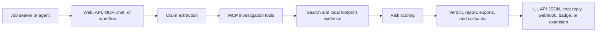

# HireProof

AI-powered job post verification for spotting suspicious listings before someone applies.

HireProof takes a pasted job post, recruiter message, screenshot, or job URL and returns a structured verdict: `safe`, `caution`, or `high-risk`. The agent extracts claims, checks company presence, searches reputation signals, compares similar jobs, verifies local footprint, and shows the evidence behind the score.

- Production demo: <https://hireproof-sigma.vercel.app>
- Live docs: <https://hireproof-sigma.vercel.app/docs>
- Author: [Mark Siazon](https://www.marksiazon.dev/)
- Built for the [Vercel Zero to Agent Hackathon](https://community.vercel.com/hackathons/zero-to-agent)

## At A Glance

| Area | Status | Where to verify |
| --- | --- | --- |
| Hosted app | Live on Vercel | <https://hireproof-sigma.vercel.app> |
| Main audit flow | Implemented | `/audit` |
| Headless API | Implemented | `POST /api/v1/audit` |
| MCP tools | Implemented | `POST /api/mcp` |
| ChatSDK | Implemented; Slack and Telegram live-tested, Discord ready, WhatsApp/Zernio credential-gated | [`docs/platform-proof-status.md`](docs/platform-proof-status.md) |
| Vercel Workflow / WDK | Implemented; production accepted-run proof captured | [`docs/platform-proof-status.md`](docs/platform-proof-status.md) |
| Chrome extension | Store-ready package and upload assets generated | [`docs/chrome-web-store-listing.md`](docs/chrome-web-store-listing.md) |
| Docker | Production image/Compose scripts implemented | `Dockerfile`, `docker-compose.yml` |

## Contents

- [Current Status](#current-status)
- [Competitive Positioning And Roadmap](#competitive-positioning-and-roadmap)
- [Hackathon Track Coverage](#hackathon-track-coverage)
- [Quick Start](#quick-start)
- [Recommended Demo Script](#recommended-demo-script)
- [Core Workflows](#core-workflows)
- [Packaging And Distribution](#packaging-and-distribution)
- [Environment Variables](#environment-variables)
- [Verification](#verification)
- [Architecture](#architecture)
- [Project Map](#project-map)
- [Documentation](#documentation)

## Current Status

HireProof is implemented as a production Next.js app with web UI, headless API, MCP tools, ChatSDK routes, WDK workflow entrypoint, Docker packaging, and a Chrome extension package workflow.

What is complete in this repo:

- Web audit flow with text, image, and voice input.
- Demo-mode seeded scenarios that work without API keys.
- Live-mode investigation path using model and search provider credentials.
- Headless `/api/v1/audit` endpoint with API-key auth and webhook support.
- MCP endpoint and investigation tools.
- ChatSDK webhook adapters for Slack, Discord, Telegram, and WhatsApp-via-Zernio.
- Vercel Workflow / WDK audit start route.
- Shareable audit reports, history, trends, PDF dossier, CSV export, PNG export, and safe-report certificate.
- Verified badge API and developer portal controls.
- Dockerfile, Compose service, healthcheck, and smoke script for self-hosting.
- Manifest V3 Chrome extension with store-ready ZIP, screenshots, promo image, listing copy, and privacy notes.

Output and sharing capabilities:

- **PNG Screenshot Export**: capture the visible report for demos and quick sharing.
- **Forensic PDF Dossier**: download a structured investigation dossier.
- **Report CSV Export**: export verdict, claims, signals, evidence, and next steps for review.

Honest external boundaries:

- Chrome Web Store publication requires the Chrome Web Store developer dashboard, privacy form, uploaded screenshots, and Google review. This repo prepares the upload package and assets; it cannot publish the listing by itself.
- Docker smoke testing requires Docker Desktop or another Docker runtime. The scripts are present, but the local machine must have Docker available.
- Live ChatSDK proof is captured for Slack and Telegram. Discord is credential-ready but still needs a real provider-event screenshot/log, and WhatsApp/Zernio needs provider credentials before proof can be claimed.
- WDK proof is currently an accepted production workflow run. Do not claim a completed long-running workflow result until a completed result and callback proof are captured.

## Competitive Positioning And Roadmap

HireProof focuses on employment fraud first because job scams happen in urgent, personal, high-risk moments where users need an actionable verdict, not a generic fraud dashboard. The narrow domain is the wedge, not the ceiling: the same evidence core is already exposed through the web app, API, MCP tools, ChatSDK agents, and WDK workflow entrypoint.

The risk model is intentionally framed as a transparent evidence-weighted safety policy. HireProof does not claim continuous machine learning or in-house deepfake detection today. Instead, it shows users which red flags, green flags, and evidence receipts drove the verdict so a job seeker can understand the decision before sharing money or personal data.

Roadmap:

- Near-term: capture Discord live-provider proof, add WhatsApp/Zernio credentials if that proof stays in scope, and re-capture the final Telegram report-link screenshot.
- Next product milestone: show a durable investigation timeline for WDK with intake, evidence checks, scoring, report creation, callback, and retry history.
- Model milestone: add calibrated learning from reviewed cases while preserving explainable red-flag evidence.
- Multimodal milestone: improve screenshot/OCR analysis and integrate specialist image or deepfake forensics providers where they add real evidence.

## Hackathon Track Coverage

HireProof is one verification agent exposed through multiple delivery surfaces.

| Track | What is implemented | Proof notes |
| --- | --- | --- |
| v0 + MCPs | Next.js app, audit workspace, evidence tools, and MCP endpoint. | Strongest primary product flow. |
| ChatSDK Agents | Shared ChatSDK bot wrapper plus Slack, Discord, Telegram, and Zernio webhook routes. | Slack has screenshot proof, Telegram has delivery screenshot/log proof, Discord is credential-ready, and WhatsApp/Zernio is credential-gated. |
| Vercel Workflow / WDK | Workflow package enabled, `startAuditWorkflow`, and `/api/workflows/audit` start route. | Production accepted run captured in proof docs. |

More detail: [`docs/triple-track-coverage.md`](docs/triple-track-coverage.md).

## Quick Start

```bash
npm install
cp .env.example .env.local
npm run dev
```

Open <http://localhost:3002> and go to `/audit`.

Demo mode works without keys. For live evidence, configure model and search credentials in `.env.local`.

## Recommended Demo Script

Use this path when showing the project to a judge, reviewer, or stakeholder:

1. Open <https://hireproof-sigma.vercel.app/audit>.
2. Select or paste the high-risk demo text:

```text
Remote frontend intern. PHP 80,000/week. No interview. Message us on Telegram.
```

3. Run the audit and show the streamed investigation steps.
4. Open the final report and point out the verdict, score, evidence, flags, and next steps.
5. Show the same core agent through the API:

```bash
curl -X POST https://hireproof-sigma.vercel.app/api/v1/audit \
  -H "Content-Type: application/json" \
  -H "x-api-key: hireproof_agent_demo_key" \
  -d '{"text":"Remote frontend intern. PHP 80,000/week. No interview. Message us on Telegram.","mode":"demo"}'
```

6. Mention the distribution surfaces: MCP tools, ChatSDK agents, WDK workflow, Docker self-hosting, and Chrome extension package.
7. Be explicit about boundaries: Chrome Store publication and Docker runtime verification depend on external account/runtime access.

## Core Workflows

### Web Audit

The main workflow lives at `/audit`.

- Paste a job listing or recruiter message.
- Upload a screenshot.
- Use browser speech-to-text for voice input.
- Watch the Server-Sent Events stream as the agent extracts claims and calls tools.
- Review the verdict, risk score, flags, evidence, and recommended next steps.

### Headless API

`POST /api/v1/audit` returns JSON for external agents and automation tools.

```bash
curl -X POST https://hireproof-sigma.vercel.app/api/v1/audit \
  -H "Content-Type: application/json" \
  -H "x-api-key: hireproof_agent_demo_key" \
  -d '{"text":"Remote frontend intern. PHP 80,000/week. No interview. Message us on Telegram.","mode":"demo"}'
```

### MCP Tools

`POST /api/mcp` exposes investigation tools for agent runtimes:

- Company presence search.
- News and reputation search.
- Comparable job search.
- Local business footprint search.

### Developer Portal

The `/developer` page supports:

- Account login and API key management.
- Domain verification for badge embeds.
- Webhook sandbox testing.
- BYOK provider credential storage for authenticated audits.

Provider credentials are verified before storage and encrypted server-side. Secrets are not returned to the browser after save.

## What Makes It Agentic

HireProof is not a single prompt wrapper. The app runs a structured investigation loop:

- Extracts normalized claims from messy human job text.
- Chooses evidence tools based on the claims it finds.
- Calls company, reputation, comparable-role, and local-footprint tools.
- Combines tool output with a transparent evidence-weighted risk policy.
- Returns a report designed for human decisions and downstream agents.

The same investigation core is reused by the web app, API, MCP endpoint, ChatSDK reply path, and workflow entrypoint.

## Packaging And Distribution

### Chrome Extension

Local install:

1. Open `chrome://extensions`.
2. Enable Developer mode.
3. Click "Load unpacked".
4. Select the `extension/` folder.

Create the Chrome Web Store upload package:

```bash
npm run package:extension
```

Output:

```text
dist/chrome/hireproof-extension.zip
```

Generate store screenshots and promo image:

```bash
npm run store:assets
```

Generated assets:

```text
docs/chrome-web-store-assets/
+-- screenshot-01-popup-idle-1280x800.png
+-- screenshot-02-popup-result-1280x800.png
+-- screenshot-03-supported-job-page-1280x800.png
+-- screenshot-04-context-menu-1280x800.png
`-- promo-small-440x280.png
```

Listing copy, reviewer notes, privacy practices, and publication boundary are in [`docs/chrome-web-store-listing.md`](docs/chrome-web-store-listing.md). Extension privacy details are in [`extension/PRIVACY.md`](extension/PRIVACY.md).

### Docker Self-Hosting

Build and run the production image:

```bash
npm run docker:build
npm run docker:run
```

In a second terminal:

```bash
npm run docker:smoke
```

Docker behavior:

- Uses Next.js standalone output.
- Runs as a non-root user.
- Exposes port `3002`.
- Includes a `/api/health` container healthcheck.
- Uses environment variables for live model, search, Redis, and workflow credentials.

Compose:

```bash
docker compose up --build
```

## Environment Variables

Copy `.env.example` to `.env.local` and fill only what you need.

| Variable | Required | Purpose |
| --- | --- | --- |
| `APP_BASE_URL` | Recommended | Base URL for internal links and callbacks. |
| `AGENT_API_KEY` | Recommended | API key accepted by `/api/v1/audit` and `/api/mcp`. |
| `SESSION_SECRET` | Recommended | Session signing secret for auth. |
| `AI_GATEWAY_API_KEY` | Live mode preferred | Vercel AI Gateway key. |
| `VERCEL_AI_GATEWAY_API_KEY` | Live mode optional | Alias accepted for AI Gateway. |
| `HIREPROOF_MODEL` | Optional | Model path, defaults to `openai/gpt-4o-mini`. |
| `MODEL_PROVIDER_KEY` | Live mode fallback | OpenAI-compatible fallback provider key. |
| `SERPAPI_API_KEY` | Live evidence | SerpApi key for search-backed evidence. |
| `UPSTASH_REDIS_REST_URL` | Optional | Upstash REST URL for persistence and rate limits. |
| `UPSTASH_REDIS_REST_TOKEN` | Optional | Upstash REST token. |
| `REDIS_URL` | ChatSDK | Redis URL for ChatSDK thread state. |
| `BYOK_ENCRYPTION_KEY` | Hosted BYOK | Encrypts saved provider credentials in production. |
| `SLACK_BOT_TOKEN` | Slack | Enables Slack bot replies. |
| `SLACK_SIGNING_SECRET` | Slack | Verifies Slack webhook signatures. |
| `DISCORD_BOT_TOKEN` | Discord | Enables Discord replies. |
| `DISCORD_PUBLIC_KEY` | Discord | Verifies Discord interactions. |
| `DISCORD_APPLICATION_ID` | Discord | Discord application ID. |
| `TELEGRAM_BOT_TOKEN` | Telegram | Enables Telegram replies. |
| `TELEGRAM_WEBHOOK_SECRET_TOKEN` | Telegram | Verifies Telegram webhooks. |
| `TELEGRAM_BOT_USERNAME` | Telegram | Bot username without `@`. |
| `ZERNIO_API_KEY` | WhatsApp/Zernio | Enables Zernio-backed replies. |
| `ZERNIO_WEBHOOK_SECRET` | WhatsApp/Zernio | Verifies Zernio webhooks. |
| `WORKFLOW_SECRET` | WDK | Protects workflow start routes. |

## Verification

Run the main local quality gates before handing off:

```bash
npm run lint
npm run build
node test/runtime-wiring.test.mjs
node test/byok-credentials.test.mjs
npm run package:extension
npm run store:assets
```

What those gates prove:

| Command | Proves |
| --- | --- |
| `npm run lint` | TypeScript contracts are valid outside generated Next build output. |
| `npm run build` | Production Next.js build succeeds. |
| `node test/runtime-wiring.test.mjs` | Runtime surfaces are wired to real endpoints and honest readiness states. |
| `node test/byok-credentials.test.mjs` | BYOK encryption, CSRF, and credential routing checks pass. |
| `npm run package:extension` | Chrome extension manifest/assets package into a clean upload ZIP. |
| `npm run store:assets` | Chrome Web Store screenshots and promo image are regenerated. |

Optional Docker verification when Docker is available:

```bash
npm run docker:build
npm run docker:run
npm run docker:smoke
```

Production smoke commands:

```powershell
$base='https://hireproof-sigma.vercel.app'
Invoke-RestMethod -Uri "$base/api/health"
Invoke-RestMethod -Uri "$base/api/integrations/proof"
Invoke-RestMethod -Uri "$base/api/v1/audit" `
  -Method Post `
  -ContentType 'application/json' `
  -Headers @{'x-api-key'='hireproof_agent_demo_key'} `
  -Body (@{
    text='Remote frontend intern. PHP 80,000/week. No interview. Message us on Telegram.'
    mode='demo'
  } | ConvertTo-Json)
```

## Demo Scenarios

Three seeded audit scenarios are available without external keys:

- **High-Risk**: Telegram-based PHP 80,000/week internship scam.
- **Caution**: Ambiguous listing with incomplete company signals.
- **Safe**: Credible listing with matching company, role, and evidence.

## Architecture



Runtime surfaces:

- Web UI uses `/api/audit` for streamed Server-Sent Events.
- External agents use `/api/v1/audit` for JSON responses and webhook callbacks.
- MCP-compatible clients use `/api/mcp` for direct tool execution.
- Chat platforms use `/api/webhooks/*` and the shared ChatSDK reply formatter.
- Durable background jobs start through `/api/workflows/audit`.
- Browser users can scan selected text or supported job pages through the Chrome extension.

## Tech Stack

| Layer | Technology |
| --- | --- |
| Framework | Next.js 16 App Router |
| Language | TypeScript 6 |
| UI | React 19, Tailwind CSS 4, Framer Motion |
| Charts | Recharts |
| AI | Vercel AI SDK 6, AI Gateway, OpenAI-compatible fallback |
| Search | SerpApi |
| Storage | Upstash Redis when configured, local JSON fallback for development |
| Protocols | REST, SSE, MCP, ChatSDK adapters, Vercel Workflow / WDK |
| Extension | Chrome Manifest V3 |
| Packaging | Docker standalone image, Compose, Chrome Web Store ZIP |

## Project Map

```text
app/
+-- audit/                         Web audit flow and report pages
+-- api/audit/                     SSE audit endpoint
+-- api/v1/audit/                  Headless JSON audit endpoint
+-- api/mcp/                       MCP tool endpoint
+-- api/chat/hireproof/            ChatSDK status/reply endpoint
+-- api/webhooks/                  Slack, Discord, Telegram, Zernio adapters
+-- api/workflows/audit/           WDK workflow start route
+-- developer/                     Developer portal
`-- docs/                          In-app documentation portal

components/
+-- audit-form.tsx
+-- result-screen.tsx
+-- risk-radar-chart.tsx
`-- site/header and UI components

lib/
+-- schemas.ts                     Shared Zod contracts
+-- risk-scorer.ts                 Evidence-weighted risk policy
+-- serpapi.ts                     Search provider integration
+-- mcp-tools.ts                   MCP investigation tools
+-- db.ts                          Hybrid persistence
+-- auth-store.ts                  Auth, API keys, BYOK credentials
`-- generate-pdf.ts                PDF dossier and certificate output

extension/
+-- manifest.json
+-- popup.html / popup.js / styles.css
+-- content.js / content.css
+-- background.js
`-- icons/

scripts/
+-- package-extension.mjs
+-- generate-extension-icons.mjs
+-- generate-chrome-store-assets.mjs
`-- smoke-docker.mjs
```

## Documentation

- [`DEPLOYMENT.md`](DEPLOYMENT.md): deployment and production status.
- [`docs/remaining-work.md`](docs/remaining-work.md): current proof status and honest boundaries.
- [`docs/chrome-web-store-listing.md`](docs/chrome-web-store-listing.md): Chrome listing copy and upload assets.
- [`docs/credentials-setup.md`](docs/credentials-setup.md): platform credential setup notes.
- [`docs/platform-proof-status.md`](docs/platform-proof-status.md): platform readiness status.
- [`docs/triple-track-coverage.md`](docs/triple-track-coverage.md): hackathon track mapping.

## License

ISC
