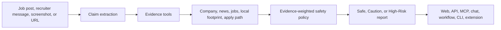
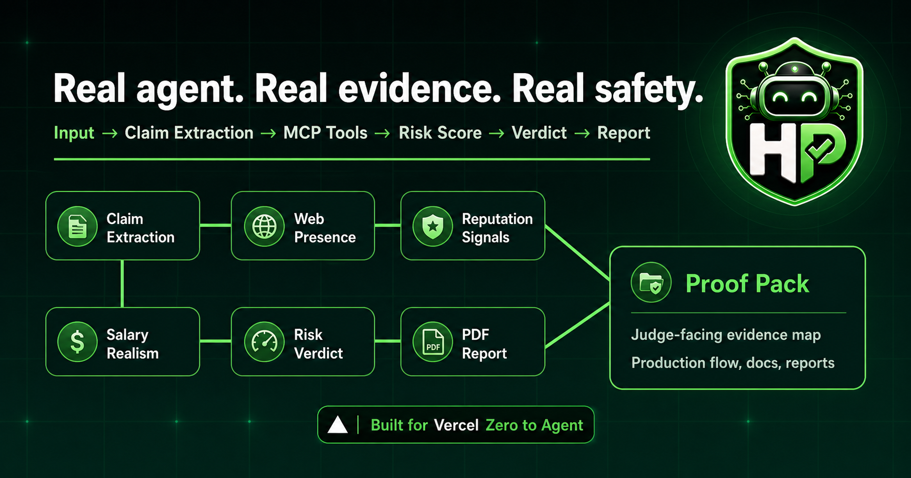

<p align="center">
  
</p>

# HireProof

Employment-fraud trust and safety for suspicious job posts, recruiter messages, screenshots, and apply links.

HireProof helps a job seeker decide whether an opportunity is worth trusting before they apply or share personal data. Paste the post, message, screenshot, or URL. The agent extracts the claims, checks evidence, and returns a `Safe`, `Caution`, or `High-Risk` verdict with visible red flags, green flags, source receipts, and next steps.

Built as a solo global hackathon project by [Mark Siazon](https://www.marksiazon.dev/) in just over one week for Cursor Hackathon.

[](https://hireproof.tech)
[](https://hireproof.tech/docs)
[](https://hireproof.tech/portfolio)
[](https://hireproof.tech/pilot)
[](https://www.marksiazon.dev/)
[](https://github.com/Iron-Mark)
[](https://ph.linkedin.com/in/mark-siazon)

[](https://hireproof.tech/audit)
[](public/downloads/hireproof-extension.zip)
[](public/downloads/hireproof-native-integrations.zip)
[](https://www.npmjs.com/package/@hireproof/cli)


## Why It Exists

Job scams often look normal until one detail breaks trust: unrealistic pay, no interview, Telegram-only contact, weak company footprint, fake recruiter identity, or a suspicious apply path. A careful applicant has to search the company, check recent news, compare legitimate roles, inspect the apply link, and still make a judgment call.

HireProof turns that manual investigation into one evidence-backed workflow. It is intentionally focused on employment fraud and job scams. It is not presented as a generic security platform, black-box fraud model, continuous-learning system, or in-house deepfake detector.

## Why People Should Care

| Audience | What HireProof gives them |
| --- | --- |
| Job seekers | A fast, understandable verdict before they send money, IDs, resumes, or personal data. |
| Career communities | A chat-ready bot path for checking suspicious posts where people already ask for help. |
| Builders | A reusable verification core exposed through web, API, MCP, ChatSDK, WDK, CLI, SDK, n8n, LangChain, and extension surfaces. |
| Judges and reviewers | A narrow, real-world safety wedge with production proof, visible evidence, and honest boundaries. |
| Future maintainers | Clear docs, proof status, packaging commands, and reproducible demo fixtures instead of a one-off event demo. |

## Use Or Download

| Action | Link |
| --- | --- |
| Open the live audit | [Run HireProof](https://hireproof.tech/audit) |
| Install the CLI | [`npx @hireproof/cli`](https://www.npmjs.com/package/@hireproof/cli) |
| Download the Chrome extension ZIP | [`hireproof-extension.zip`](public/downloads/hireproof-extension.zip) |
| Download native integration source pack | [`hireproof-native-integrations.zip`](public/downloads/hireproof-native-integrations.zip) |
| Import n8n HTTP workflow | [`hireproof-n8n-workflow.json`](public/downloads/hireproof-n8n-workflow.json) |
| Use Make HTTP config | [`hireproof-make-http-config.json`](public/downloads/hireproof-make-http-config.json) |
| Use standalone LangChain tool | [`hireproof-langchain-tool.ts`](public/downloads/hireproof-langchain-tool.ts) |
| Run curl smoke template | [`hireproof-automation-curl.sh`](public/downloads/hireproof-automation-curl.sh) |

## Live Links

| Destination | Link |
| --- | --- |
| Production app | <https://hireproof.tech> |
| Main audit flow | <https://hireproof.tech/audit> |
| Portfolio case study | <https://hireproof.tech/portfolio> |
| Pilot intake | <https://hireproof.tech/pilot> |
| Public docs | <https://hireproof.tech/docs> |
| Track proof | <https://hireproof.tech/docs/triple-track-coverage> |
| Health check | <https://hireproof.tech/api/health> |
| Integration proof | <https://hireproof.tech/api/integrations/proof> |
| Discord install | <https://discord.com/oauth2/authorize?client_id=1500240100804530336&scope=bot%20applications.commands&permissions=0> |
| Creator portfolio | <https://www.marksiazon.dev/> |

## At A Glance

| Capability | Current status | Proof or notes |
| --- | --- | --- |
| Web audit flow | Implemented and production deployed | `/audit` on the stable Vercel alias |
| Evidence-backed reports | Implemented | verdict, score, red flags, green flags, evidence cards, exports |
| Headless API | Implemented | `POST /api/v1/audit` |
| MCP tools | Implemented | `POST /api/mcp` for investigation tools |
| ChatSDK agents | Implemented | Slack screenshot proof, Telegram delivery proof, Discord credential-ready |
| Vercel Workflow / WDK | Implemented | production accepted-run proof, not a completed workflow transcript |
| CLI, SDK, n8n, LangChain | Implemented and package-oriented | package status documented in `docs/automation-integrations.md` |
| Chrome extension | Store-ready repo package | external Chrome Web Store publication still required |
| Docker self-hosting | Scripts and image files present | Docker runtime required for smoke verification |

## The Product Flow



The score is explainable by design. HireProof shows the evidence that drove the decision instead of asking the user to trust a hidden model.

## Demo In 60 Seconds

1. Open <https://hireproof.tech/audit>.
2. Paste this suspicious sample:

```text
Remote frontend intern. PHP 80,000/week. No interview. Message us on Telegram.
```

3. Run the audit.
4. Show the verdict, score, evidence cards, red flags, and next steps.
5. Explain the same verification core also runs through API, MCP tools, ChatSDK routes, WDK workflow, CLI, SDK, n8n, LangChain, and the Chrome extension package.

For API proof:

```bash
curl -X POST https://hireproof.tech/api/v1/audit \
  -H "Content-Type: application/json" \
  -H "x-api-key: hireproof_agent_demo_key" \
  -d '{"text":"Remote frontend intern. PHP 80,000/week. No interview. Message us on Telegram.","mode":"demo"}'
```

Demo mode is fixture-based and explicitly labeled. Live evidence mode uses provider-backed checks when credentials are configured.

## What HireProof Checks

- Company presence and legitimacy signals.
- Recent news, reputation, and scam-adjacent context.
- Comparable legitimate jobs and salary context.
- Local business footprint where relevant.
- Apply-path consistency between pasted text, OCR text, URLs, and known public job pages.
- Recruiter and contact-channel signals.
- Screenshot OCR text. Google Vision OCR runs first, with Tesseract fallback after OCR-oriented image preprocessing when configured.
- Source quality, freshness, and evidence coverage.

## Trust Model

HireProof uses a transparent evidence-weighted safety policy.

| Mode | What it means |
| --- | --- |
| Live evidence mode | Runs the real evidence path when model, search, and optional provider credentials are configured. |
| Demo fixture mode | Shows the same report shape with seeded fixture evidence for reliable demos and offline judging. It should not be described as live evidence. |
| Verified-only safer alternatives | Safer alternatives appear only when comparable job evidence has a real source URL or provider-backed metadata. |
| Screenshot privacy | Screenshot-derived reports are not publicly listed by default and are excluded from public Explore and Trends. Direct report links still work. |
| Operational honesty | Missing providers, the SerpApi circuit breaker, queue throttles, or cache fallbacks are surfaced as boundaries instead of hidden. |

## Proof Posture

| Surface | Safe claim | Boundary |
| --- | --- | --- |
| Production web app | Stable public alias is available at `https://hireproof.tech`. | Recheck live URL before final submission or public launch. |
| API smoke | Demo API path returns a structured High-Risk report with the public demo key. | Live evidence depends on configured model/search credentials. |
| Slack | Screenshot proof exists for a real HireProof reply. | Endpoint-level logs should be recaptured if judges require fresh log proof. |
| Telegram | Live delivery proof exists with screenshot/log evidence. | The final report-link screenshot should be recaptured after permalink fallback changes. |
| Discord | Credentials, webhook readiness, install link, and slash commands exist. | Do not claim live Discord proof until a real message screenshot and matching log are captured. |
| WDK | Production route accepted a workflow run. | Do not claim completed long-running workflow transcript until callback/result proof exists. |
| Chrome extension | Manifest V3 package workflow, assets, listing copy, and privacy notes exist. | Chrome Web Store publication requires external dashboard and Google review. |
| Docker | Dockerfile, Compose, healthcheck, and smoke script exist. | Docker runtime is required for local smoke proof. |

Full proof notes:

- [`docs/platform-proof-status.md`](docs/platform-proof-status.md)
- [`docs/triple-track-coverage.md`](docs/triple-track-coverage.md)
- [`docs/final-live-vs-pending-status.md`](docs/final-live-vs-pending-status.md)
- [`docs/current-audit-behavior.md`](docs/current-audit-behavior.md)



## Hackathon Track Coverage

HireProof is one verification core exposed through multiple surfaces.

| Track | Implementation | Why it matters |
| --- | --- | --- |
| v0 + MCPs | Next.js app, audit workspace, evidence tools, and MCP endpoint. | The clearest user-facing product flow and agent tool surface. |
| ChatSDK Agents | Shared bot reply path plus Slack, Discord, and Telegram webhook routes. | Lets job-seeker communities check suspicious posts inside chat. |
| Vercel Workflow / WDK | Workflow package enabled with `/api/workflows/audit` start route. | Provides the path for durable, background investigations. |

## Product Surfaces

| Surface | Path or package | Use case |
| --- | --- | --- |
| Web app | `/audit` | Job seekers paste suspicious posts and get a report. |
| Headless API | `POST /api/v1/audit` | Agents and automations request structured verdict JSON. |
| MCP endpoint | `POST /api/mcp` | Tool-compatible clients call investigation functions. |
| ChatSDK | `/api/webhooks/slack`, `/api/webhooks/discord`, `/api/webhooks/telegram` | Communities ask the bot to check suspicious posts. |
| WDK route | `/api/workflows/audit` | Starts asynchronous investigation work when credentials are configured. |
| CLI | `@hireproof/cli` | Terminal audits, JSON output, health checks, and Shield Sentinel TUI. |
| SDK | `hireproof-sdk` | Typed API client for JavaScript and TypeScript projects. |
| LangChain | `@hireproof/langchain` | Structured audit tool for LangChain pipelines. |
| n8n | `n8n-nodes-hireproof` | Native automation node package. |
| Chrome extension | `extension/` and `public/downloads/hireproof-extension.zip` | Scan selected job text or supported pages from the browser. |

## Developer Quick Start

```bash
npm install
cp .env.example .env.local
npm run dev
```

Open <http://localhost:3002>.

Minimum useful checks:

```bash
npm run lint
npm run build
node --test test/runtime-wiring.test.mjs
```

Demo fixtures work without provider keys. Live evidence mode needs model/search credentials such as AI Gateway or an OpenAI-compatible provider plus SerpApi. See [`docs/credentials-setup.md`](docs/credentials-setup.md).

## Environment Groups

| Group | Variables |
| --- | --- |
| App and API | `APP_BASE_URL`, `AGENT_API_KEY`, `SESSION_SECRET` |
| Model routing | `AI_GATEWAY_API_KEY`, `VERCEL_AI_GATEWAY_API_KEY`, `HIREPROOF_MODEL`, `MODEL_PROVIDER_KEY` |
| Evidence search | `SERPAPI_API_KEY` |
| Persistence and rate limits | `UPSTASH_REDIS_REST_URL`, `UPSTASH_REDIS_REST_TOKEN`, `REDIS_URL` |
| Hosted BYOK | `BYOK_ENCRYPTION_KEY` |
| Slack | `SLACK_BOT_TOKEN`, `SLACK_SIGNING_SECRET` |
| Discord | `DISCORD_BOT_TOKEN`, `DISCORD_PUBLIC_KEY`, `DISCORD_APPLICATION_ID`, `DISCORD_GUILD_ID` |
| Telegram | `TELEGRAM_BOT_TOKEN`, `TELEGRAM_WEBHOOK_SECRET_TOKEN`, `TELEGRAM_BOT_USERNAME` |
| Optional provider adapters | `ZERNIO_API_KEY`, `ZERNIO_WEBHOOK_SECRET` |
| Workflow | `WORKFLOW_SECRET` |
| Cursor (optional) | `CURSOR_INTEGRATION_ENABLED`, `CURSOR_API_KEY`, `CURSOR_MODEL_ID`, `CURSOR_RUNTIME_DEFAULT`, `CURSOR_WEBHOOK_SECRET`, `CURSOR_MAX_CONCURRENT_RUNS`, `CURSOR_ALLOWED_REPO_URL` |

## Cursor integration

Cursor accelerates **contributor workflows** (repo health, docs drift, exploratory UI QA) from `/developer` and secured internal cron routes. It does **not** participate in public audit verdicts (`/api/audit`, `/api/v1/audit`, or MCP investigation truth paths).

1. Copy Cursor variables from [`.env.example`](.env.example) into `.env.local`.
2. Set `CURSOR_INTEGRATION_ENABLED=true` only after `CURSOR_API_KEY` is configured server-side.
3. Pin cloud runs with `CURSOR_ALLOWED_REPO_URL` (falls back to `GITHUB_REPO_URL` when unset).
4. Use **Developer portal → Cursor Agents** for preset runs, or call `POST /api/developer/cursor/runs` (session auth + same-origin CSRF).
5. Schedule ops jobs with `x-cursor-job-secret` on:
   - `GET /api/internal/cursor/nightly-repo-health`
   - `POST /api/internal/cursor/ui-qa` (body: `{ "baseUrl": "https://your-preview.example" }`)
6. Enable **Cursor Bugbot** in the Cursor dashboard and require its GitHub check on protected branches (see [`.github/workflows/cursor-integration.yml`](.github/workflows/cursor-integration.yml) comments).

CI runs `npm run lint`, `npm run build`, and `node --test test/cursor*.test.mjs` without a Cursor API key.

## Architecture


Runtime shape:

- Web UI streams audit progress through `/api/audit`.
- External agents call `/api/v1/audit`.
- MCP-compatible clients call `/api/mcp`.
- Chat platforms call `/api/webhooks/*` and share the same reply formatter.
- Durable background jobs start through `/api/workflows/audit`.
- Reports can be shared, exported as PNG/PDF/CSV, or delivered through webhook callbacks.

Core stack:

| Layer | Technology |
| --- | --- |
| Framework | Next.js 16 App Router, React 19, TypeScript 6 |
| UI | Tailwind CSS 4, custom HireProof tokens, Framer Motion, lucide-react |
| AI | Vercel AI SDK, AI Gateway, OpenAI-compatible fallback |
| Evidence | SerpApi, OCR path, domain/apply-path checks, provider fallbacks |
| Storage | Upstash Redis when configured, local JSON fallback for development |
| Integrations | REST, SSE, MCP, ChatSDK adapters, Vercel Workflow / WDK |
| Packaging | npm workspaces, Chrome Manifest V3, Docker standalone image |

## CLI Proof

<picture>
  <source media="(prefers-color-scheme: dark)" srcset="public/cli-tui-screenshot-dark.png">
  
</picture>

```bash
npx @hireproof/cli --help
npx @hireproof/cli tui
npx @hireproof/cli audit --text "Remote frontend intern. PHP 80,000/week. No interview. Telegram only." --mode demo
```

Local CLI:

```bash
npm run cli -- --help
npm run cli -- tui
npm run cli -- audit --text "Remote frontend intern. PHP 80,000/week. No interview. Telegram only." --mode demo
```

## Packaging

Chrome extension:

```bash
npm run package:extension
npm run store:assets
```

Automation integrations:

```bash
pnpm integrations:build
pnpm integrations:test
pnpm integrations:package
```

Docker:

```bash
npm run docker:build
npm run docker:run
npm run docker:smoke
```

Docker smoke requires a working Docker runtime.

## Verification

Recommended local gates:

```bash
npm run lint
npm run build
node --test test/runtime-wiring.test.mjs
node --test test/byok-credentials.test.mjs
npm run package:extension
npm run store:assets
pnpm integrations:build
pnpm integrations:test
pnpm integrations:package
```

Production smoke checks:

```powershell
$base='https://hireproof.tech'
Invoke-RestMethod -Uri "$base/api/health"
Invoke-RestMethod -Uri "$base/api/integrations/proof"
Invoke-RestMethod -Uri "$base/api/v1/audit" `
  -Method Post `
  -ContentType 'application/json' `
  -Headers @{'x-api-key'='hireproof_agent_demo_key'} `
  -Body (@{
    text='Remote frontend intern. PHP 80,000/week. No interview. Message us on Telegram.'
    mode='demo'
  } | ConvertTo-Json)
```

## Project Map

```text
app/
+-- audit/                         Web audit flow and report pages
+-- api/audit/                     SSE audit endpoint
+-- api/v1/audit/                  Headless JSON audit endpoint
+-- api/mcp/                       MCP tool endpoint
+-- api/chat/hireproof/            ChatSDK status and reply endpoint
+-- api/webhooks/                  Slack, Discord, Telegram adapters
+-- api/workflows/audit/           WDK workflow start route
+-- developer/                     Developer portal
`-- docs/                          In-app documentation portal

components/
+-- audit/                         Audit form, result screen, charts, voice input
+-- brand/                         Brand mark and verified badge
+-- docs/                          API playground and docs components
+-- layout/                        Header, footer, command menu
+-- marketing/                     Landing-page components
+-- system/                        Theme, toast, error, confetti utilities
`-- ui/                            Shared primitive UI components

lib/
+-- schemas.ts                     Shared Zod contracts
+-- risk-scorer.ts                 Evidence-weighted risk policy
+-- serpapi.ts                     Search provider integration
+-- mcp-tools.ts                   MCP investigation tools
+-- db.ts                          Hybrid persistence
+-- auth-store.ts                  Auth, API keys, BYOK credentials
`-- generate-pdf.ts                PDF dossier and certificate output

extension/
+-- manifest.json
+-- popup.html / popup.js / styles.css
+-- content.js / content.css
+-- background.js
`-- icons/

scripts/
+-- package-extension.mjs
+-- package-integrations.mjs
+-- validate-integrations.mjs
+-- generate-extension-icons.mjs
+-- generate-chrome-store-assets.mjs
`-- smoke-docker.mjs
```

## Documentation

- [`docs/final-submission-pack.md`](docs/final-submission-pack.md): title, tagline, demo scripts, copy blocks, caveats, screenshot checklist.
- [`docs/platform-proof-status.md`](docs/platform-proof-status.md): production proof state and platform boundaries.
- [`docs/triple-track-coverage.md`](docs/triple-track-coverage.md): v0 + MCP, ChatSDK, and WDK mapping.
- [`docs/current-audit-behavior.md`](docs/current-audit-behavior.md): live mode, demo mode, safer alternatives, provider boundaries.
- [`docs/final-live-vs-pending-status.md`](docs/final-live-vs-pending-status.md): concise live vs pending status.
- [`docs/assets-index.md`](docs/assets-index.md): logos, social previews, platform graphics, Chrome Web Store assets.
- [`docs/chrome-web-store-listing.md`](docs/chrome-web-store-listing.md): extension listing and reviewer notes.
- [`docs/automation-integrations.md`](docs/automation-integrations.md): CLI, SDK, n8n, Make, and LangChain integration status.
- [`docs/after-hackathon-cost-safety.md`](docs/after-hackathon-cost-safety.md): wallet-safety runbook for keeping production live after judging.
- [`docs/portfolio-case-study.md`](docs/portfolio-case-study.md): portfolio-ready solo global hackathon case study by Mark Siazon.
- [`docs/evidence-screenshot-checklist.md`](docs/evidence-screenshot-checklist.md): proof capture checklist.
- [`DEPLOYMENT.md`](DEPLOYMENT.md): deployment notes.

## Creator

HireProof was designed, built, documented, packaged, and polished as a solo global hackathon project by Mark Siazon.

- Portfolio: <https://www.marksiazon.dev/>
- GitHub: <https://github.com/Iron-Mark>
- LinkedIn: <https://ph.linkedin.com/in/mark-siazon>

## License

ISC
