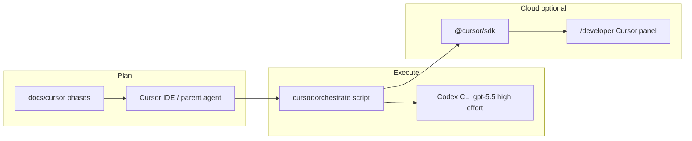

# Cursor + Codex orchestration

HireProof rolls out Cursor integration in **phases**. **Cursor** (IDE, rules, skills, parent agent) owns planning and repo-specific guardrails; **Codex CLI** runs read-only analysis passes with a pinned model and reasoning effort; **`@cursor/sdk`** drives optional **cloud** agent runs from the developer portal and internal cron routes.

## What runs where

| Responsibility | Runtime | Notes |
| --- | --- | --- |
| Phase planning, diffs, PR review context | **Cursor IDE** or Cursor cloud agent | Uses `.cursor/skills`, `BUGBOT.md`, hooks |
| Lint, `node --test`, file presence checks | **`npm run cursor:orchestrate`** (Node) | Same gates as [`.github/workflows/cursor-integration.yml`](../../.github/workflows/cursor-integration.yml) |
| Deploy readiness checklist (Phase 3) | **Codex CLI** `gpt-5.5` + high reasoning | Read-only sandbox; no production HTTP |
| Developer portal / scheduled repo health | **`@cursor/sdk`** via `lib/cursor` | Requires `CURSOR_API_KEY`; never on public audit paths |
| Product verdicts | **HireProof APIs** (`/api/audit`, `/api/mcp`) | Cursor must not replace these |



## Phases (source of truth)

Phase definitions live in [README.md](./README.md) inside the `cursor-orchestration-phases` block. The orchestrator script parses that JSON—do not duplicate phase IDs elsewhere without updating README.

| Phase | Goal | Automated checks |
| --- | --- | --- |
| **0** | Baseline quality | `npm run lint`, `node --test` on `test/cursor*.test.mjs` (direct shell) |
| **1** | Repo Cursor config | Required `.cursor/*` files, project rules, cloud environment config, and `scripts/cursor-pretool-guard.mjs` |
| **2** | SDK readiness (optional) | Import `@cursor/sdk` when `CURSOR_API_KEY` is set and `CURSOR_INTEGRATION_ENABLED=true`; else skip with message |
| **3** | Deploy readiness | **Codex** read-only: 10-line checklist from `overview.md` + `deploy.md` |
| **4** | Internal routes | Print how to call `/api/internal/cursor/*` locally; **no production calls** from the script |

## Model and reasoning (Codex CLI — Windows defaults)

This repo’s orchestrator pins:

| Setting | Value | Override env |
| --- | --- | --- |
| Model | `gpt-5.5` | `CODEX_ORCHESTRATE_MODEL` |
| Reasoning effort | `high` (`model_reasoning_effort`) | `CODEX_ORCHESTRATE_REASONING_EFFORT` |
| Sandbox | `read-only` | `CODEX_ORCHESTRATE_SANDBOX` |
| Working directory | HireProof repo root | `-C` passed to `codex exec` |

**`xhigh` reasoning:** only use if your local `~/.codex/config.toml` and `codex exec -c` accept it (`codex features` / `codex exec --help`). The orchestrator defaults to **`high`** so runs work on standard installs without extra config.

Equivalent manual command (Phase 3 prompt abbreviated):

```bash
codex exec \
  -m gpt-5.5 \
  -c 'model_reasoning_effort="high"' \
  -C "/path/to/HireProof" \
  -s read-only \
  "Read docs/cursor/overview.md and docs/cursor/deploy.md; output a 10-line deploy readiness checklist..."
```

PowerShell one-liner (from repo root):

```powershell
npm run cursor:orchestrate
```

Wrapper with env defaults:

```powershell
.\scripts\orchestrate-cursor-phases.ps1
```

## Install Codex CLI (if missing from PATH)

The repo does **not** ship Codex. Install via your org’s documented package (often npm global):

```powershell
npm install -g @openai/codex
# or the package name your team uses
where.exe codex
codex login
```

Other common locations: `npm prefix -g` → `bin\codex.cmd`, `%USERPROFILE%\.local\bin\codex`.

If `npm run cursor:orchestrate` reports Codex missing, phases **0–2** and **4** still run; Phase **3** prints the manual `codex exec` line above.

On **Windows**, npm installs `codex` as `codex.cmd` / `codex.ps1`; the orchestrator invokes `cmd.exe /c codex …` so Node `spawn` works from `npm run` without a TTY.

## Finding Codex CLI (do not hardcode paths)

| Platform | Commands |
| --- | --- |
| Windows | `where.exe codex`, `Get-Command codex` |
| macOS / Linux | `command -v codex`, `which codex` |
| npm global | `npm prefix -g` then inspect `bin/` |

## Pretool guard (required for agents)

Cursor hooks run [`scripts/cursor-pretool-guard.mjs`](../../scripts/cursor-pretool-guard.mjs) before shell execution (see [`.cursor/hooks.json`](../../.cursor/hooks.json)). The hook emits Cursor permission JSON and uses `failClosed: true` so guard failures block execution instead of allowing risky shell commands through. The orchestrator does **not** bypass hooks. Codex runs use **read-only** sandbox and must not invoke destructive patterns blocked by the guard.

Background/cloud agents use [`.cursor/environment.json`](../../.cursor/environment.json) to install dependencies with `npm ci` and keep `npm run dev` available in a terminal session.

Prefer:

- `npm run lint`, `npm run build`, `node --test test/cursor*.test.mjs`
- Preview/staging URLs for HTTP checks

See [.cursor/skills/hireproof-architecture/SKILL.md](../../.cursor/skills/hireproof-architecture/SKILL.md).

## Cursor SDK smoke (Phase 2)

When `CURSOR_API_KEY` is set and `CURSOR_INTEGRATION_ENABLED=true`, Phase 2 verifies `@cursor/sdk` loads (no live agent run). Otherwise the phase logs a skip reason. Full cloud runs: `/developer` or secured internal routes—see [sdk.md](./sdk.md) and `node scripts/cursor-smoke.mjs` with a local dev server.

## Commands

```bash
# All phases (0–4)
npm run cursor:orchestrate

# Single phase
node scripts/orchestrate-cursor-phases.mjs --phase 0

# Skip Codex Phase 3
node scripts/orchestrate-cursor-phases.mjs --no-codex
```

Windows: `scripts/orchestrate-cursor-phases.ps1` sets `CODEX_ORCHESTRATE_*` env vars then calls the `.mjs` script.

## Related

- [overview.md](./overview.md) — architecture boundaries
- [deploy.md](./deploy.md) — Vercel env vars and enablement
- [automation.md](./automation.md) — internal cron routes
- [sdk.md](./sdk.md) — developer portal SDK
- [AGENTS.md](../../AGENTS.md) — Codex agent repo instructions
