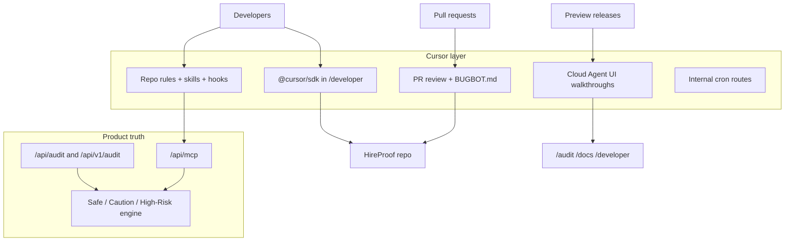

# Cursor integration — overview

HireProof uses Cursor to **compound developer experience and repository quality**. Cursor must **not** become a single point of truth for audit verdicts, public API behavior, or end-user fraud decisions.

## Product truth (never delegate to Cursor)

| Surface | Role |
| --- | --- |
| `/api/audit`, `/api/v1/audit` | Authoritative investigation and scoring pipeline |
| `/api/mcp` | Machine-readable investigation tools for agents |
| `lib/mcp-tools.ts`, scorer, schemas | Verdict engine and evidence contracts |

End users and integrators rely on these paths. Cursor agents may **read** and **propose changes** to them; they must not **replace** them at runtime.

## Cursor layer (dev acceleration only)

| Surface | Role |
| --- | --- |
| `@cursor/sdk` | Optional developer-portal and internal agent runs behind server-side feature flags |
| `.cursor/rules/`, `.cursor/skills/`, hooks | Contributor guardrails and MCP-first habits |
| Bugbot + `.cursor/BUGBOT.md` | PR review on security-sensitive paths |
| Cloud Agent QA | Exploratory UI walkthroughs with metadata first; artifact ingestion is future work |
| Internal cron routes | Repo health, docs drift (secured webhooks) |

## Architecture diagram

## Two skill scopes

| Path | Audience | Purpose |
| --- | --- | --- |
| `.agents/skills/hireproof/SKILL.md` | Any IDE / agent user | Investigate job posts via MCP or headless API |
| `.cursor/rules/hireproof-architecture.mdc` | Cursor Agent / Inline Edit | Always-on repo architecture and safety rules |
| `.cursor/skills/hireproof-architecture/SKILL.md` | Cursor SDK agents | Live-vs-demo honesty, SSRF, secrets, MCP-first edits |

Do not merge these into one file—they serve different users.

## Suggested rollout order

1. **Bugbot** — `.cursor/BUGBOT.md` + GitHub check (no app code)
2. **Repo rules, skills + pretool guard** — `.cursor/rules`, `.cursor/skills`, `.cursor/environment.json`, `scripts/cursor-pretool-guard.mjs`, hooks
3. **Docs** — this folder + `/docs/cursor` on the live site
4. **SDK panel** — `@cursor/sdk`, secured routes, feature flag, run metadata
5. **Cloud Agent QA + cron** — preview-only, metadata-first
6. **Cloud Agent environment governance** — scoped secrets, environment version review, audit log visibility

## Fallback discipline

If Cursor is unavailable: static docs, API playground, Playwright, `npm run lint` / `build` / `node --test`, and human review. The product must keep shipping without Cursor.

See also: [sdk.md](./sdk.md), [mcp.md](./mcp.md), [bugbot.md](./bugbot.md), [qa.md](./qa.md).
