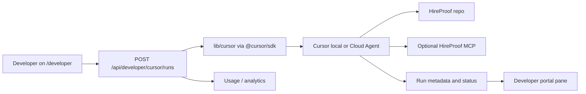

# Cursor SDK (developer portal)

**Status:** Implemented behind feature flags. The repo includes `@cursor/sdk`, `lib/cursor/*`, `POST /api/developer/cursor/runs`, and secured internal Cursor routes. Use this page for the current developer-portal contract and safe example prompts.

## Goal

Expose **optional** Cursor SDK agent runs from `/developer` so builders can scaffold integrations, review docs drift, or run safe repo tasks - without routing end-user audits through Cursor.

## Target flow



## Security

- Reuse patterns from `app/api/developer/provider-credentials`: origin validation, rate limits, authenticated session.
- **Current key model:** Use server-side `CURSOR_API_KEY`; never expose it to browsers or logs.
- **Future user-key model:** If per-user Cursor keys are added later, store them through the hosted encrypted vault and require `BYOK_ENCRYPTION_KEY`.
- **Feature flag:** `CURSOR_INTEGRATION_ENABLED=false` until QA passes. Keep any client-side flags display-only.
- **Repo pin:** `CURSOR_ALLOWED_REPO_URL` fixed to this repository. Do not accept arbitrary repo targets from user input.
- **Run output:** The current portal stores run metadata/status. Streaming logs and artifact ingestion are future work.

## Environment variables

| Variable | Purpose |
| --- | --- |
| `CURSOR_INTEGRATION_ENABLED` | Server-side feature flag |
| `CURSOR_API_KEY` | Platform-managed runs, server-side only |
| `CURSOR_MODEL_ID` | Configurable model id, default `composer-2` |
| `CURSOR_RUNTIME_DEFAULT` | `local` or `cloud` |
| `CURSOR_WEBHOOK_SECRET` | Internal cron / webhook auth |
| `CURSOR_MAX_CONCURRENT_RUNS` | Spend and contention cap |
| `CURSOR_ALLOWED_REPO_URL` | Cloud Agent repo pin |

## Runtime notes

- Local runtime uses `Agent.create({ local: { cwd } })` from the server process.
- Cloud runtime uses `Agent.create({ cloud: { repos: [...] } })` and requires `CURSOR_ALLOWED_REPO_URL` or `GITHUB_REPO_URL`.
- SDK runs may use `.cursor/skills/`, `.cursor/rules/`, `.cursor/hooks.json`, and MCP configuration.
- HireProof keeps product verdicts in `/api/audit`, `/api/v1/audit`, `/api/mcp`, and `lib/mcp-tools.ts`.

## Degradation

When the key is missing, the flag is off, or Cursor is down:

- Show static docs and example prompts.
- Keep the existing API playground as the primary integration path.
- Let `scripts/cursor-smoke.mjs` exit `0` with a skip message when the integration is intentionally off.

## Example prompts

**Generate Next.js integration**

```text
Read app/docs/headless-api and lib/schemas.ts. Propose a minimal Next.js App Router example that calls POST /api/v1/audit with x-api-key from env. Do not weaken origin or SSRF patterns from existing routes.
```

**Docs / env drift review**

```text
Compare README.md, DEPLOYMENT.md, .env.example, and docs/automation-integrations.md for stale routes, env vars, or API examples. List mismatches only; propose minimal doc fixes in a separate branch.
```

**Security-focused diff review**

```text
Review the current branch diff under app/api/ and lib/ for: SSRF on user URLs, weakened rate limits, secret logging, demo-vs-live disclosure regressions. Cite file paths; do not change product verdict logic.
```

## References

- Cursor SDK changelog: [cursor.com/changelog/sdk-release](https://cursor.com/changelog/sdk-release)
- Cursor SDK blog: [cursor.com/blog/typescript-sdk](https://cursor.com/blog/typescript-sdk)
- HireProof developer portal: `/developer`
- Phase 1 config: [bugbot.md](./bugbot.md), [mcp.md](./mcp.md)
