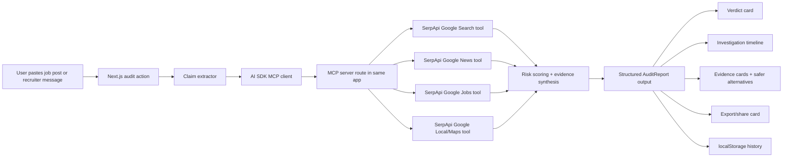

# Cursor Hackathon Winning Report

This report consolidates the constraints and angles from your prior prompt batches—official-rules strategy, second-batch contrarian research, and advanced-tech angle testing—into one decisive plan. fileciteturn0file0 fileciteturn0file1 fileciteturn0file2

## Executive Summary

The highest-probability path is **the v0 + MCPs track** on entity["organization","Vercel","cloud platform"], not Workflows and not Chat SDK. The official hackathon rules reward **usefulness, technical execution, and originality**, require a **solo**, **live Vercel deployment**, and combine **community voting** with **Vercel team input**. The official timeline is fixed in **PT**: submissions close **May 3, 2026 at 23:59 PT**, and voting runs **May 4, 2026 for 24 hours** with one vote per project and no self-voting. citeturn3view0turn1view0turn16search0

For a solo builder in entity["city","Manila","Metro Manila, Philippines"], the smartest project is not “more agent architecture.” It is **a sharper product with a visible agentic proof loop**. The best concept is:

**HireProof**  
**Tagline:** *Paste a job post. Know if it is legit before you apply.*  
**Core job:** A proof-backed AI agent that audits a job post or recruiter pitch using live web evidence, news, local business presence, and comparable openings, then returns a **risk score, red flags, proof links, and safer alternatives**.

Why this wins:

- It maps directly to the stated rubric: **real-world applicability**, technical execution, originality. citeturn16search0turn16search1
- It is highly relevant in the entity["country","Philippines","southeast asia"], where authorities still flag **job scams and task scams** as active monitored schemes, and where the UN is documenting scam-center recruitment through false job promises. citeturn31view2turn31view1turn26search4
- It is instantly legible to community voters in one screenshot: **input → investigation timeline → red/amber/green verdict → safer alternatives**.
- It uses entity["company","SerpApi","search api company"] in a way that feels necessary, not decorative: **Google Jobs, Google Search, Google News, and Google Local/Maps** are the actual evidence engine. citeturn13search2turn13search0turn13search1turn14search0
- It gives you a **real MCP story**, not a fake one. This matters because v0’s own docs make a subtle but critical point: MCP servers connected inside v0 help **during generation**, but the generated app **cannot directly use those MCP tools at runtime**. If you want a judge-believable MCP project, you should add a **small runtime MCP server** inside the app and consume it with the AI SDK MCP client. citeturn1view5turn30search0turn30search1turn28search0turn28search9

The exact recommendation is:

- **Track:** v0 + MCPs
- **Product:** HireProof
- **Runtime pattern:** Next.js app with a **small local MCP server** exposing SerpApi-backed tools
- **Agent runtime:** AI SDK + structured output + MCP client
- **Persistence:** localStorage for MVP; Neon only if you finish early
- **Vote strategy:** optimize for **one-screen comprehension**, **15-second short-form**, and **sample input that produces a dramatic result**
- **Do not waste time on:** auth, giant dashboards, Web3 wallets, multi-agent theater, and Slack/Discord app approvals

## Event Intelligence and White Space

### Confirmed facts and what they mean

The official Cursor Hackathon hub states that the event runs **April 24 to May 4, 2026**, centers on shipping **real, working AI agents**, and offers three tracks: **Workflows**, **v0 + MCPs**, and **ChatSDK Agents**. The rules page confirms that the submission window closes **May 3 at 23:59 PT**, entries are **solo only**, projects must be **deployed on Vercel**, and the final outcome blends **community voting** with **Vercel team input**. citeturn1view0turn3view0

For your local execution in entity["city","Manila","Metro Manila, Philippines"], the important operational detail is timezone conversion. On April 25, 2026, PT is **UTC-07:00** while Manila is **UTC+08:00**, which means Manila is **15 hours ahead**. So the hard global submission deadline of **May 3, 23:59 PT** lands at **May 4, 14:59 PHT**. Voting from **May 4, 00:00 PT to 23:59 PT** becomes **May 4, 15:00 PHT to May 5, 14:59 PHT**. If you think “deadline is May 3 local,” you are leaving useful build time on the table. citeturn3view0turn25time0turn25time1

The official Manila meetup page adds three strategic facts: the in-person mini-hackathon includes a **2-hour build**, **5-minute participant presentations**, and **live community voting during presentations**; it explicitly lists the **Community Favorite** and **Short-Form Content Award**; and it names entity["company","SerpApi","search api company"] as a sponsor. That means your response surface is not just judges—it is also **room-level audience reaction**, **global showcase clicks**, and **short-form discoverability**. citeturn5view0

### Showcase state and white space

As of the current official showcase page, only **two visible projects** are listed: **Craic Planner**, a travel-planning agent built with v0 + Workflow SDK, and **Acnie**, an AI skincare transparency tool that scans product labels and suggests safer alternatives. The page surfaces each entry using a **screenshot, title, short description, and link**. That means projects are being judged socially at card-glance speed before anyone opens them. citeturn6view0

| Visible project | What it is | Strength | Gap it leaves |
|---|---|---|---|
| Craic Planner | Travel concierge + planning workflow | Clear multi-step agent story | Travel is already “claimed” |
| Acnie | Label-decoding consumer safety tool | Immediate usefulness + visual clarity | Cosmetic/ingredient scanner angle is already “claimed” |

The white space is not “another assistant.” The white space is **high-trust verification for high-anxiety decisions**. That includes jobs, rentals, scholarships, bootcamps, vendors, claims, and public-information truth checks. Those categories are stronger than generic planning because the “agent did work for me” moment is obvious: the system brings back **evidence**, not vibes. That inference is supported both by the judging rubric and by the current showcase mix. citeturn16search0turn16search1turn6view0

### Judge psychology and voter psychology

The official meetup pages repeat the judging rubric in plain language: **agent usefulness / real-world applicability**, **technical execution**, and **creativity / originality**. That means judges do not need a sci-fi stack. They need to believe the app solves something real, is actually built on the event stack, and is not derivative. citeturn16search0turn16search1

Community voters are a different game. In the entity["country","Philippines","southeast asia"], DataReportal reports **95.8 million social media user identities** by late 2025, **98.0 million internet users**, and a **median age of 26.1**. In that same population, Pew reports that among adults under 30, **43%** regularly get news from entity["company","TikTok","short video platform"], while Philippine survey work shows Gen Z is highly trend-aware, highly image-conscious, and strongly shaped by peer perception and visible social validation. In short: voters will reward **clarity, immediacy, aesthetic confidence, and shareable outputs**. citeturn20view0turn20view1turn20view2

That leads to the second-batch thesis:

1. **Evidence beats chat.** A result card with proof links is more voteable than a chat transcript.  
2. **One-frame understanding beats feature breadth.** Showcase cards are shallow-first. citeturn6view0  
3. **Local pain with global relevance beats niche novelty.** Job scams are legible everywhere, especially to builders and students. citeturn31view1turn31view2turn26search4  
4. **Short-form is not extra credit.** The event literally has a short-form award; your content plan is part of the strategy. citeturn5view0  
5. **Real MCP at runtime is a hidden edge.** Most entrants will likely use MCP only inside v0 generation and then talk about it loosely. You can beat that by shipping a visible runtime MCP integration. citeturn1view5turn30search0turn28search0

## Track Decision and Tech Audit

### Track recommendation

The Workflows track is real and technically strong. Official docs position Workflow as **resumable**, **durable**, and able to **pause for minutes or months**, with human-in-the-loop patterns and observability through CLI and web UI. That is excellent for long-running asynchronous agents. But it is also exactly the kind of thing solo builders overbuild for a hackathon when a synchronous, dramatic 30-second demo would have scored higher. citeturn9search0turn23search0turn23search1turn23search5

The Chat SDK track is also real. It offers a **single codebase** for bots across entity["company","Slack","work messaging platform"], entity["company","Discord","chat platform"], Google Chat, entity["company","GitHub","developer platform"], and more, with adapters, state management, cards, and streaming. But it adds platform setup, webhooks, app approval friction, and lower visual payoff for a UI-first solo builder. citeturn8view5turn8view6turn8view7turn8view8

The best fit is **v0 + MCPs** because it preserves your strongest edge—fast UI/UX polish—while still allowing a technically respected implementation. The crucial nuance is that v0’s own MCP feature mainly helps **v0 during generation**; it does not magically make the deployed app itself an MCP-native runtime. So the winning version of this track is not “I used an MCP preset while building.” It is “my live agent app actually talks to an MCP server at runtime.” The AI SDK explicitly supports MCP clients and recommends **HTTP transport for production**, while Vercel provides official templates for running MCP servers on Next.js or Vercel Functions. citeturn1view5turn30search0turn30search1turn28search0turn28search9turn28search2

| Track | Reward profile | Solo risk | Demo strength | Why not / why yes |
|---|---|---:|---:|---|
| Workflows | High backend credibility | High | Medium | Great if the core win is long-running durability; weak if you only need a fast proof loop |
| v0 + MCPs | Best balance of speed + technical depth | Medium | High | **Best fit** if you ship a real runtime MCP story |
| Chat SDK Agents | Cross-platform novelty | High | Medium | Too much setup friction for this deadline and your strengths |

### v0 battle map

v0’s current docs support a very specific, very hackathon-friendly workflow: **start with UI**, then add the data layer, then add core features, then polish. It generates **real code**, supports **Next.js App Router conventions**, likes **Next.js + Tailwind + shadcn/ui**, works with screenshots and Figma inputs, can connect to external APIs and databases, can connect to GitHub with automatic branching and commits, and deploys to Vercel with one click. It also has built-in agentic developer features like **web search**, **site inspection**, and **automatic error fixing**. citeturn21search3turn1view3turn22view4turn22view2turn22view3turn1view4turn22view0turn1view6turn1view2

| v0 capability | Trust it with | Verify manually |
|---|---|---|
| App shell and routes | Yes | Folder structure and route names |
| Landing page polish | Yes | Copy clarity and CTA hierarchy |
| shadcn/Tailwind UI | Yes | Excessive sameness / genericity |
| Form generation | Yes | Validation edge cases |
| API scaffolding | Yes | Error handling, secrets, rate limits |
| GitHub integration | Yes | Repository source-of-truth risk and final PR state |
| External API wiring | Mostly | Environment variables and server-only usage |
| MCP during generation | Yes for build help | Do **not** confuse this with runtime MCP |
| Error fixing | Useful | Never trust blind autofix on agent logic |
| Visual tweaks in Design Mode | Yes | Regression in layout and state variants |

The hidden advantage for you is not just speed. It is **version discipline**. v0’s GitHub integration creates dedicated branches per chat, auto-commits code changes, and protects `main`. That is perfect for hackathon branch isolation when you want one “stable demo” branch and one “polish/experiment” branch. citeturn22view0

### SerpApi leverage

entity["company","SerpApi","search api company"] is useful only when it gives your agent **live external context that a static prompt cannot fake**. For HireProof, four endpoints matter:

| Endpoint | Why it matters | MVP verdict |
|---|---|---|
| Google Jobs API | Finds comparable legit openings, schedule type, benefits, apply channels | **Keep** |
| Google Search API | Verifies official site, web presence, knowledge graph, indexed reputation | **Keep** |
| Google News API | Surfaces recent warnings, scam reports, layoffs, or company signals | **Keep** |
| Google Local / Maps API | Checks physical presence, address, phone, hours, local footprint | **Keep** |
| Trends / Trends News | Interesting for virality and public buzz | Stretch |
| Shopping | Not relevant to HireProof | Cut |
| YouTube transcript | Possible recruiter-video audits, but not MVP | Cut |

The supporting documentation is there: Google Jobs returns titles, companies, locations, schedule types, descriptions, benefits, and apply options; Google Search supports localization; Google News returns title, snippet, source, date, and link; Google Local / Maps returns phone numbers, addresses, hours, and coordinates. SerpApi also exposes a very broad engine catalog, which is useful for stretch features later but unnecessary for MVP. citeturn27search2turn13search13turn13search0turn13search1turn14search0turn14search5

A practical hackathon bonus: the Google Jobs docs note that cached searches can be served for free and are not counted against monthly usage, with a one-hour cache expiry. That makes it easier to rehearse a demo repeatedly without burning quota. citeturn27search2

### Advanced-tech audit

#### What survives the seven-point test

Your filter was right: only advanced layers that are **visible**, **30-second explainable**, **judge-credible**, **solo-feasible**, **safe-fail**, and **not buzzword bait** should survive.

| Advanced layer | Pass / fail | Why |
|---|---|---|
| Runtime MCP server + AI SDK MCP client | **Pass** | Visible if tool timeline is shown; direct fit to track; official templates and docs exist |
| Structured output + Zod schema | **Pass** | Makes the result feel product-grade, not chatty |
| Tool calling with approval point | **Pass** | Human-in-the-loop without Workflow overhead |
| Workflow durability | Conditional fail | Technically strong, but overkill unless monitoring/alerts are core |
| RAG | Fail for MVP | Adds invisible plumbing; value here is current web evidence, not document recall |
| Multi-agent / subagents | Fail for MVP | AI SDK docs explicitly warn they add latency and complexity; not needed here |
| Browser automation | Fail | Fragile demo, external-site breakage risk |
| Evals | Soft pass as polish | Great credibility, but invisible until after MVP |
| Web3 / agent wallets | Hard fail | More friction than value unless the problem is inherently onchain |

That view is heavily supported by the official docs: the AI SDK supports structured outputs, tool calling, approval controls, telemetry, testing, and MCP clients; its subagent docs explicitly say to avoid subagents when tasks are simple and focused; Vercel’s AI-agent overview frames good agent patterns as sequential processing, routing, orchestration, and evaluation loops; and Workflow is best when durability is the actual product, not just a stack flex. citeturn11search0turn12search0turn12search1turn12search2turn18search1turn24search0turn9search0

#### Web3 feature audit

Official Web3 docs show that entity["company","Coinbase","crypto exchange"] AgentKit gives AI agents wallet and onchain capabilities, while entity["organization","Ethereum","blockchain network"] account abstraction lets smart-contract wallets initiate transactions with custom logic. On paper, that sounds sophisticated. In a solo build-week reality, it usually means **wallet setup, key management, testnet instability, and explanation debt**. Unless your core user problem is inherently onchain, Web3 makes the demo worse, not better. citeturn17search0turn17search1turn17search3turn17search11

| Web3 angle | Visible capability | Solo risk | Verdict |
|---|---:|---:|---|
| Agent wallet payments | Medium | High | Cut |
| Escrow for freelance gigs | High | High | Interesting, but not this hackathon sprint |
| Onchain ticket verification | Medium | High | Too much integration friction |
| Donation provenance | Medium | High | Good cause, weak 30-second demo |
| Credential attestations | Low | Medium | Too abstract for voters |

The same logic applies to entity["organization","Solana","blockchain network"] agent tooling. It is real, but it is not the strongest move for this event under your constraints. citeturn17search2

## Idea Mining and Scoring

### Anti-obvious idea list

Weighted rubric used for scoring: **Judge appeal 25%, demo wow 20%, feasibility 20%, usefulness 15%, technical credibility 10%, community appeal 10%**. Penalties are applied for buzzword dependence, fragile demos, approval friction, weak explainability, or high-safety risk.

| Idea | Core job | Score |
|---|---|---:|
| HireProof | Audit suspicious job posts and return scam-risk proof + safer alternatives | **91.8** |
| InternCheck | Verify internship posts and recruiter claims before students apply | 87.2 |
| ScholarScout | Verify scholarships/grants and summarize dead links, legitimacy, and fit | 86.7 |
| RentProof | Audit rental listings for scam signals and safer alternatives | 86.3 |
| OfferAudit | Audit “too good to be true” online offers beyond jobs | 85.7 |
| PriceWitness | Compare local alternatives when a product/service price feels inflated | 85.5 |
| SellerShield | Check online sellers using web/local footprint and complaint signals | 83.3 |
| VendorWitness | Verify vendors/suppliers before paying deposits | 83.2 |
| PolicyPilot | Turn customer complaint text into evidence-backed response drafts | 83.2 |
| BootcampTruth | Audit course/bootcamp claims, outcomes, and hidden catches | 83.0 |
| ClaimCheck | Pre-check insurance/benefit claim requirements and missing evidence | 82.0 |
| EventTruth | Verify events, sponsors, and venue legitimacy | 81.5 |
| ContractFlash | Surface the red-flag clauses in short agreements | 81.3 |
| ScholarshipROI | Compare scholarships by actual fit, cost, and hidden obligations | 81.0 |
| FloodReady | Route/disruption assistant | 80.2 |

The pattern is obvious: **verification agents** beat “assistant” agents because the value is explicit, current, and evidence-backed.

### AI × Web3 ideas

| Idea | Core thesis | Score | Verdict |
|---|---|---:|---|
| EscrowMate | AI escrow assistant for freelance milestones | 70.5 | Interesting, too much payments complexity |
| BountyProof | Verifies Web3 bounties and contributor legitimacy | 70.1 | Niche and wallet-adjacent |
| DonationTrace | Tracks donation flows onchain | 69.8 | Noble, weak demo punch |
| TicketProof | Verifies ticket legitimacy via onchain records | 68.3 | Needs external infra and trust bridges |
| GrantChain | Verifies grants and bounty programs onchain | 68.0 | Overcomplicated relative to benefit |
| WalletGuard | AI wallet safety review and approval flow | 67.3 | High trust/safety burden |
| AttestApply | Credential attestations for applicants | 67.1 | Too abstract |
| ChainClause | Smart-contract-aware agreement auditor | 66.4 | Hard to explain fast |
| CreatorTipAgent | Micro-payment and tipping optimizer | 66.2 | Weak urgency |
| AirdropLieDetector | Flags sketchy airdrops | 64.6 | Feels buzzwordy |

None of the Web3 concepts beats the best non-Web3 concept under your rules, time, and audience model.

### Advanced-AI ideas

| Idea | Core thesis | Score | Verdict |
|---|---|---:|---|
| HireProof | Job-post investigator with proof links and safer alternatives | **91.8** | **Winner** |
| ScholarScout | Scholarship/grant verifier | 86.7 | Strong runner-up |
| RentProof | Rental scam investigator | 86.3 | Strong runner-up |
| OfferAudit | General risky-offer auditor | 85.7 | Good, but too broad |
| PriceWitness | Local alternative/value witness | 85.5 | Strong community appeal |
| VendorWitness | Vendor trust check  er | 83.2 | Less universal |
| PolicyPilot | Evidence-backed response drafter | 83.2 | Less visual |
| EventTruth | Venue/sponsor legitimacy checker | 81.5 | Good, but narrower |
| CivicPulse | Public rumor / news triage card | 80.3 | High value, higher safety risk |
| FloodReady | Route/disaster assistant | 80.2 | High pain, data brittleness |

### Why HireProof wins over the rest

HireProof beats the field because it combines **real consumer protection**, **builder-adjacent usefulness**, **live evidence**, **MCP legitimacy**, and **a screenshotable result artifact**. It also fits the current social atmosphere in the entity["country","Philippines","southeast asia"], where cybercrime is still actively monitored and job/task scams continue to appear among watched schemes. citeturn31view2turn31view1turn26search4

## Recommended Product and Architecture

### Product thesis

**Name:** HireProof  
**Tagline:** Paste a job post. Know if it is legit before you apply.  
**Ten-word pitch:** An AI agent that investigates job posts before you trust them.  
**Thirty-word pitch:** HireProof researches a job post across search, news, local presence, and comparable openings, then returns a risk score, proof cards, and safer alternatives you can actually apply to.  
**Hundred-word pitch:** HireProof is a live, proof-backed AI verification agent for job seekers. Instead of guessing whether a listing is real, users paste a job post, recruiter pitch, or suspicious opportunity. The system extracts claims, researches the company and role across live web results, news, local business signals, and comparable openings, then generates a structured audit with a clear verdict: safe, caution, or high-risk. It also explains why, cites the evidence, and suggests safer alternatives. The result is not “AI advice.” It is an investigation product.

### Before and after

**Before:** You see a job post with high pay, vague details, and a Telegram contact. You either ignore it or risk wasting time, data, and maybe money.

**After:** You paste it into HireProof. The agent extracts company, role, salary, location, and contact method; checks live evidence; spots mismatches with real job-market patterns; finds risk signals; and returns a clean report card with safer options.

### The best audience hooks

| Rank | Hook |
|---|---|
| 1 | **Paste a job post. Know if it is legit before you apply.** |
| 2 | **Not another chatbot. A job-post investigator.** |
| 3 | **This agent does the background check you were about to do manually.** |
| 4 | **Too good to be true? Check it first.** |
| 5 | **It does not “advise.” It verifies.** |
| 6 | **Stop getting baited by sketchy job offers.** |
| 7 | **Find the red flags before the red flags find you.** |
| 8 | **A safer next step than “message us on Telegram.”** |
| 9 | **Your job search needs proof, not motivational fluff.** |
| 10 | **The agent that turns job anxiety into evidence.** |

### Vote-magnet checklist

A community-favorite build should have all of these on first open:

- one dramatic sample input already visible
- one click to run the audit
- a high-contrast verdict badge
- a timeline showing the agent worked
- proof links/evidence cards
- a shareable result card
- a human-readable explanation, not model babble
- zero login wall
- zero “coming soon” sections
- a 15-second clip that mirrors the live flow

### UI and UX strategy

Your biggest unfair advantage is still UI. Use it.

**Visual direction:** editorial + investigative, not neon cyberpunk. Think “modern risk lab,” not “AI dashboard template.”

**Core screens:**
- landing page with a dominant proof-forward CTA
- audit workspace
- result report
- lightweight history page
- optional share card / export panel

**Layout rules:**
- give the hero a real sample input box, not fake decoration
- use a three-zone result layout: verdict, timeline, evidence
- show tools as chips or step cards so MCP/tool usage is visible
- use asymmetry and spacing discipline to avoid the “generic v0” look
- treat red/yellow/green verdict colors as semantic accents only; keep the base palette restrained

**Avoid-generic-v0 checklist:**
- no glassmorphism overload
- no giant gradient blobs
- no “AI powered” hero as primary message
- no giant sidebar-first dashboard if the product is actually single-task
- no chat-first UX if the output is a structured report
- no fake analytics panels
- no auth screens
- no dark mode obsession before functionality
- no 12-card feature grid on the landing page
- no lorem-style sample copy

### Architecture

The winning architecture is intentionally simple:

- **Next.js App Router**
- **Tailwind + shadcn/ui**
- **AI SDK** for parsing, tool calling, and structured outputs
- **Tiny local MCP server** deployed inside the same app
- **SerpApi** behind MCP tools
- **localStorage** for MVP history
- **optional Neon** only if you finish early and want shareable server-side reports

The important design choice is this: **runtime MCP is the differentiator**. Official docs support both sides of this build—Vercel provides MCP deployment templates, and the AI SDK provides `createMCPClient` with recommended HTTP transport for production. citeturn28search0turn28search9turn30search0turn30search1



### Routes and components

| Area | Path / file |
|---|---|
| Landing page | `app/page.tsx` |
| Main audit workspace | `app/audit/page.tsx` |
| History page | `app/history/page.tsx` |
| MCP route | `app/api/mcp/route.ts` |
| Audit action / route | `app/api/audit/route.ts` or `app/actions/audit.ts` |
| Agent logic | `lib/agent/hireproof-agent.ts` |
| MCP client | `lib/mcp/client.ts` |
| SerpApi wrappers | `lib/serpapi.ts` |
| Risk schema | `lib/schema/audit.ts` |
| Demo fixtures | `lib/demo/*.json` |
| Export/share card | `components/report-card.tsx` |

### Agent design

**Agent name:** HireProof Investigator  
**Role:** Verify whether a job opportunity is real, risky, or suspicious using live external evidence.  
**Inputs:** pasted job text, recruiter message, job URL, optional user location  
**Outputs:** structured audit with verdict, risk score, red flags, confidence, citations, safer alternatives  
**Tools:** `search_company`, `news_check`, `jobs_compare`, `local_presence` via MCP  
**Memory:** none beyond session result; durable memory is not required for MVP  
**Approval point:** user approves export/save/share; no auto-applying, no outbound messaging  
**Failure handling:** if live tools fail, switch to labeled demo data mode

**System prompt:**
```text
You are HireProof Investigator, a verification agent for job opportunities.
Your job is to assess whether a job post appears legitimate, risky, or suspicious.

Rules:
- Be evidence-first. Do not guess if evidence is missing.
- Use tools to verify company presence, recent news, comparable roles, and local footprint.
- Explain risks in plain language.
- Distinguish between "missing evidence" and "suspicious evidence".
- Output only valid structured data following the provided schema.
- Never instruct the user to send money, share ID documents, or contact the recruiter.
- If confidence is low, say so clearly.
```

**Tool-use instruction:**
```text
Investigate in this order:
1. Extract core claims from the job post.
2. Verify company/site presence with search.
3. Check recent news for risk or credibility signals.
4. Compare role details against comparable openings.
5. Check local business footprint if relevant.
6. Score risk using evidence, not tone.
7. Recommend safer alternatives only if role/location is extractable.
```

**Output schema:**
```ts
type AuditReport = {
  verdict: "safe" | "caution" | "high-risk";
  riskScore: number; // 0-100
  confidence: "low" | "medium" | "high";
  summary: string;
  extractedClaims: {
    company?: string;
    role?: string;
    location?: string;
    salary?: string;
    contactMethod?: string;
    url?: string;
  };
  redFlags: string[];
  greenFlags: string[];
  evidence: Array<{
    tool: "search" | "news" | "jobs" | "local";
    title: string;
    snippet: string;
    url?: string;
    signal: "positive" | "neutral" | "negative";
  }>;
  saferAlternatives: Array<{
    title: string;
    company: string;
    location?: string;
    source?: string;
    url?: string;
  }>;
  nextSteps: string[];
};
```

### Security and trust audit

This app should feel safe immediately.

- No exposed API keys in the client
- No auto-submissions to recruiter platforms
- No wallet flows
- No payment handling
- No upload of IDs or resumes in MVP
- Clear disclaimer: “support tool, not legal guarantee”
- Strip or hash personal data in logs
- Add a visible “Live data / Demo data” badge
- Rate-limit the audit endpoint lightly if you have time
- Use server-side environment variables only

## Execution System

### Exact MVP scopes

#### Two-hour mini-hackathon scope

Goal: a believable prototype you can present live in five minutes.

Ship:
- landing page
- one audit form
- one preloaded sample input
- one live or mocked result card
- visible investigation timeline
- Vercel deployment

Cut:
- auth
- history
- share links
- custom MCP route if it blocks you; use direct server wrappers temporarily, but keep MCP in the plan for final submission

#### Six-hour scope

Ship:
- real audit flow
- structured result object
- Search + Jobs tools live
- one safer-alternatives section
- demo mode fixtures
- good empty/loading/error states

#### Twelve-hour scope

Ship:
- runtime MCP route
- AI SDK MCP client
- News + Local evidence
- history via localStorage
- export/share card
- polished landing copy

#### Twenty-four-hour scope

Ship:
- full visual polish
- OG image
- short-form recording system
- submission copy
- community-vote CTA and pinned sample flow
- basic analytics or event logging if time remains

### Time-boxed build plan

```mermaid
gantt
    title HireProof build plan in Manila time
    dateFormat  YYYY-MM-DD
    section Lock
    Concept lock and copy lock      :a1, 2026-04-25, 1d
    section Build
    App shell + landing + workspace :a2, 2026-04-25, 2d
    SerpApi wrappers + audit logic  :a3, 2026-04-26, 2d
    MCP route + AI SDK client       :a4, 2026-04-27, 2d
    section Polish
    Result card + states + motion   :a5, 2026-04-29, 2d
    Demo mode + history             :a6, 2026-04-30, 1d
    section Submission
    Video + screenshots + README    :a7, 2026-05-01, 2d
    QA + final copy + dry run       :a8, 2026-05-03, 1d
    Submit before 2026-05-04 14:59 PHT :milestone, a9, 2026-05-04, 0d
```

### Exact first v0 prompt

Paste this first:

```text
Build a production-looking Next.js App Router web app called HireProof.

Product:
HireProof is an AI verification agent for job opportunities.
A user pastes a suspicious job post, recruiter pitch, or job URL.
The app investigates it and returns:
1. a verdict badge: Safe / Caution / High-Risk
2. a numeric risk score from 0 to 100
3. a short plain-language summary
4. extracted claims like company, role, location, salary, contact method
5. red flags
6. green flags
7. an investigation timeline UI showing the agent checked search, news, comparable jobs, and local presence
8. evidence cards with title, snippet, source label, and positive/neutral/negative signal
9. safer alternative jobs
10. next steps

Design goals:
- not a generic AI chatbot
- editorial investigative feel, clean and premium
- strong hierarchy, asymmetrical spacing, serious trust signals
- use Next.js, TypeScript, Tailwind, shadcn/ui
- responsive and accessible
- no auth
- no fake analytics dashboard
- no giant sidebar by default
- no glassmorphism overload
- no excessive gradients

Pages:
- landing page at /
- main audit workspace at /audit
- history page at /history

Landing page requirements:
- hero headline: “Paste a job post. Know if it’s legit before you apply.”
- clear sample suspicious input card
- CTA to open /audit
- concise sections: how it works, why it matters, what evidence it checks
- polished social-proof style layout even without logos
- include a “demo mode available” note

Audit workspace requirements:
- large textarea for pasted job text or recruiter message
- optional URL field
- optional location field defaulting to Philippines
- primary CTA: Investigate
- sample input chips
- loading state with visible investigation steps
- result layout with verdict panel, timeline, evidence grid, safer alternatives, and export/share buttons
- clean empty state before first run

History page:
- simple clean list of previous local reports
- cards showing verdict, company, role, score, timestamp
- empty state

Implementation requirements:
- create reusable components
- structure app cleanly for later integration with AI SDK, MCP, and SerpApi
- use mock data first so the full experience is demoable immediately
- include polished empty, loading, error, and success states
- generate all code needed for the UI and routing
- include comments marking where runtime logic will plug in later

Do not:
- add authentication
- add chat bubbles
- add unnecessary settings pages
- add database complexity yet
- overcomplicate the first version

Return the full app scaffold with routes, components, and mock data wired in.
```

### Exact v0 prompt chain

Use these in order. After every generation, commit or snapshot the working state.

#### Prompt one

```text
Refine HireProof into a concise PRD inside the codebase comments and scaffold the final route map, component tree, and state model. Keep the existing UI. Add a technical TODO checklist for AI SDK, MCP server route, SerpApi wrappers, localStorage history, and demo mode.
```

Inspect: route map, TODOs, component ownership  
Recovery: “Restore previous UI exactly and only add the PRD comments and TODO scaffolding.”  
Do not touch: landing hero layout

#### Prompt two

```text
Apply a custom design system for HireProof: editorial investigative feel, neutral base palette, semantic risk colors, strong typography, thin borders, subtle shadows, custom badges, and non-generic cards. Keep everything Tailwind + shadcn/ui compatible.
```

Inspect: token consistency, verdict colors, typography  
Recovery: “Revert layout changes, keep only the design tokens and component styling updates.”  
Do not touch: screen structure

#### Prompt three

```text
Improve the landing page so it sells the product in under 10 seconds. Add a premium hero, a real sample suspicious job post card, a three-step how-it-works section, and a clear CTA to /audit. Keep copy sharp and non-generic.
```

Inspect: hook clarity, CTA visibility  
Recovery: “Keep the original structure and only rewrite copy + spacing.”  
Do not touch: hero CTA

#### Prompt four

```text
Build the /audit workspace as the main product screen. Use a large input area, optional URL and location fields, sample chips, and a two-column result-ready layout that can show verdict, timeline, evidence, and alternatives.
```

Inspect: form hierarchy, mobile stacking  
Recovery: “Restore the previous audit layout and only expand the form and result regions.”  
Do not touch: field names

#### Prompt five

```text
Add strong form validation with zod-style client feedback. Validate that at least one of pasted text or URL is present. Add inline helper text and polished disabled/loading CTA behavior.
```

Inspect: empty submission, field errors  
Recovery: “Preserve all visual design and only add validation logic + messages.”  
Do not touch: CTA text

#### Prompt six

```text
Create a visible investigation timeline component for the audit flow. Show steps for Extract Claims, Search Presence, Check News, Compare Jobs, Check Local Footprint, Score Risk. Add loading, active, success, and failure visual states.
```

Inspect: timeline readability and motion  
Recovery: “Keep layout; simplify the timeline into vertical cards if the current design breaks.”  
Do not touch: step names

#### Prompt seven

```text
Build the result screen UI using mock structured data. Include a verdict badge, risk score ring, confidence label, summary block, extracted claims table, red flags, green flags, evidence cards, safer alternatives, and next steps.
```

Inspect: one-screen comprehension  
Recovery: “Keep the existing workspace and only replace placeholders with the structured result sections.”  
Do not touch: verdict placement

#### Prompt eight

```text
Add an export/share result card UI. It should generate a compact visual summary that can be screenshotted or shared: verdict, score, 3 top red flags, and ‘safer alternatives found’ indicator.
```

Inspect: screenshot quality  
Recovery: “If share card breaks layout, render it in a modal or side panel instead.”  
Do not touch: main result screen

#### Prompt nine

```text
Create the /history page using local mock records first. Use a clean list or masonry card layout with filters for all, safe, caution, high-risk. Add an empty state and clear actions to re-open a report.
```

Inspect: lightweight, not dashboard-heavy  
Recovery: “Switch to a simple card list if filters clutter the page.”  
Do not touch: no sidebar

#### Prompt ten

```text
Add demo mode to HireProof. Create 3 polished sample cases: an obvious scammy recruiter pitch, a caution-level ambiguous listing, and a safer legitimate listing. Add a visible badge when demo data is being shown.
```

Inspect: sample drama and contrast  
Recovery: “Keep only 3 fixtures and remove any extra fake cases.”  
Do not touch: sample case names

#### Prompt eleven

```text
Implement localStorage persistence for completed audits and history. Persist only the structured report and timestamp. Add hydration-safe logic and graceful fallback if storage is unavailable.
```

Inspect: hydration warnings, refresh persistence  
Recovery: “Move persistence into a client-only hook if needed.”  
Do not touch: record shape

#### Prompt twelve

```text
Create the HireProof structured types and zod schemas in a central file. Define AuditReport, EvidenceItem, AlternativeJob, and ExtractedClaims. Wire the result screen to consume these typed objects cleanly.
```

Inspect: schema completeness  
Recovery: “Preserve the result UI and only centralize the types/schema.”  
Do not touch: field names already used in UI

#### Prompt thirteen

```text
Add a runtime MCP server route for HireProof using a Next.js-compatible structure. It should expose four tools: search_company, news_check, jobs_compare, local_presence. For now, return mocked data objects in each tool so the server shape is working.
```

Inspect: route file structure, tool names  
Recovery: “Simplify the MCP route to a single file and keep the same tool names.”  
Do not touch: tool contracts

#### Prompt fourteen

```text
Replace the mocked MCP tool internals with SerpApi-backed wrappers. Create a server-only helper file for SerpApi requests. Each tool should return normalized data shaped for HireProof rather than raw API responses.
```

Inspect: server-only imports, env usage  
Recovery: “Keep wrappers isolated in lib/serpapi.ts and do not leak keys client-side.”  
Do not touch: normalized response shapes

#### Prompt fifteen

```text
Integrate AI SDK into HireProof. Add a server-side audit action that:
1. extracts claims from user input
2. connects to the MCP server with createMCPClient over HTTP
3. makes the model use the MCP tools
4. returns a final structured AuditReport object
Use a clear placeholder for the model provider environment variable.
```

Inspect: server flow clarity, no client secret leaks  
Recovery: “If MCP client wiring is unstable, isolate it behind a single lib/mcp/client.ts helper without changing the UI.”  
Do not touch: action signature

#### Prompt sixteen

```text
Add a robust risk-scoring layer after tool results. Convert evidence into a final verdict using explicit heuristics plus the model’s explanation. Make the output deterministic enough that obvious scam cases reliably score high-risk.
```

Inspect: obvious scam case behavior  
Recovery: “Use a hybrid approach with rule-based penalties before final model explanation.”  
Do not touch: verdict labels

#### Prompt seventeen

```text
Upgrade the audit action to support live mode and demo mode. If live API calls fail, automatically fall back to demo fixtures with a visible ‘Demo Data’ badge and a user-friendly notice.
```

Inspect: failure fallback path  
Recovery: “Catch all server errors and return a typed demo report object.”  
Do not touch: result layout

#### Prompt eighteen

```text
Add polished loading, empty, and error states across HireProof. The loading state should feel like a real investigation, not a spinner. The error state should offer retry and demo mode.
```

Inspect: emotional pacing  
Recovery: “Reduce loading complexity if it feels too slow or noisy.”  
Do not touch: timeline component

#### Prompt nineteen

```text
Polish mobile responsiveness across all screens. Keep the verdict and CTA visible early on mobile. Make evidence cards and timeline stack cleanly without looking like a dashboard.
```

Inspect: mobile first screen, button placement  
Recovery: “Collapse secondary panels into accordions on mobile only.”  
Do not touch: desktop composition

#### Prompt twenty

```text
Polish accessibility across HireProof: semantic headings, keyboard navigation, visible focus states, label associations, contrast improvements, and status announcements for investigation progress.
```

Inspect: focus order, aria roles  
Recovery: “Only add a11y fixes, do not redesign.”  
Do not touch: visual brand feel

#### Prompt twenty-one

```text
Add final visual polish: microinteractions, subtle motion, refined spacing, stronger empty states, cleaner section labels, and a more premium result card. Keep the product serious and trustworthy.
```

Inspect: over-animation risk  
Recovery: “Reduce all motion to opacity/translate transitions only.”  
Do not touch: color semantics

#### Prompt twenty-two

```text
Create metadata and social assets for HireProof. Add page metadata, Open Graph content, Twitter/X card copy, and an OG image direction that clearly shows the verdict + score + red flags.
```

Inspect: headline and OG clarity  
Recovery: “Use a simple OG card with verdict badge and sample input if complex art fails.”  
Do not touch: product name

#### Prompt twenty-three

```text
Prepare HireProof for deployment on Vercel. Verify environment variable placeholders, server-only imports, route handlers, and build safety. Remove dead code and add notes for required variables:
SERPAPI_API_KEY
MODEL_PROVIDER_KEY
APP_BASE_URL
```

Inspect: build errors, env references  
Recovery: “Do not refactor features; only fix deployment blockers.”  
Do not touch: UI copy

#### Prompt twenty-four

```text
Generate a concise README and hackathon submission pack inside the repo. Include:
- what HireProof does
- why it is agentic
- how MCP is used at runtime
- how SerpApi is used
- how to run locally
- required environment variables
- demo script summary
- screenshots needed for Showcase
Keep it hackathon-ready and polished.
```

Inspect: clarity, no bloated README  
Recovery: “Keep README under 120 lines and optimize for judges.”  
Do not touch: project scope

### Manual coding checklist

| File | What to check manually |
|---|---|
| `app/api/mcp/route.ts` | tool registration, output normalization, server-only imports |
| `lib/serpapi.ts` | `gl`, `hl`, timeout handling, empty-response handling |
| `lib/mcp/client.ts` | base URL resolution in dev/prod |
| `lib/agent/hireproof-agent.ts` | prompt quality, tool ordering, structured output validation |
| `lib/schema/audit.ts` | schema mismatch and optional fields |
| `app/audit/page.tsx` | hydration-safe history reads, loading states |
| `app/layout.tsx` | metadata, title templates, OG defaults |
| `middleware.ts` if added | accidental blocking of showcase users |
| `README.md` | exact setup instructions |
| `public/og.png` or `app/opengraph-image.tsx` | visual clarity at thumbnail size |

### Reliability and fallback plan

Three modes:

1. **Live mode** — real SerpApi + model  
2. **Cached mode** — reuse prior results for repeated demo runs where possible  
3. **Demo mode** — prebuilt fixtures with visible label  

Your live demo should always start from a sample case that you have already run once. Your fail-safe demo should be exactly the same UI but backed by fixtures. Never let an API outage destroy the presentation.

## Demo, Submission, Votes, Risks, Final Call

### Demo scripts

#### Five-minute Manila script

**Hook:**  
“Everyone has seen a job post that feels off. The problem is you usually find out too late.”

**Problem:**  
“Job scams and task scams still show up in the Philippines, and verifying a listing manually means opening five tabs and still guessing.” citeturn31view2turn31view1turn26search4

**Live input:**  
Paste a suspicious job pitch:
“Remote frontend intern. ₱80,000/week. No interview. Message us on Telegram.”

**Agent moment:**  
“Now HireProof extracts the claims, checks company presence, checks recent news, compares legitimate roles, and looks for local footprint.”

**Result reveal:**  
Show the high-risk verdict, three red flags, and safer alternatives.

**Technical credibility line:**  
“This is a real Next.js app on Vercel. The agent uses AI SDK structured outputs and talks to a local MCP server at runtime. The MCP tools call SerpApi for live evidence.”

**v0 line:**  
“v0 generated the interface, routing, and much of the scaffolding. I then wired the runtime MCP and evidence flow.”

**Closing:**  
“Not another chatbot. A job-post investigator.”

#### Three-minute version

“Paste a suspicious listing. HireProof investigates it live using search, news, jobs, and local evidence. It gives you a risk score, says why, and offers safer alternatives.”

#### Sixty-second version

“Job posts can look real until you spot the gaps. HireProof does that background check for you. Paste the post. It researches the company, compares the role, checks the footprint, and returns a clear scam-risk verdict with proof.”

#### Thirty-second voting version

“Built for Cursor Hackathon: HireProof. Paste a job post. It investigates whether it’s legit before you apply. Live evidence. Clear risk score. Safer alternatives.”

#### Fifteen-second short-form

“Sketchy job post? Paste it. HireProof researches it live and tells you if it’s safe, caution, or high-risk—before you waste your time.”

#### Backup no-live-demo version

Use the exact same flow in **demo mode** with a badge visible. Say:  
“This is the same UI and same structured output, switched to demo fixtures so I can show the full experience reliably.”

### Submission package

**Title:** HireProof  
**Short description:** A proof-backed AI agent that audits job posts before you apply.  
**Long description:** HireProof is a live verification agent for job opportunities. Users paste a job post, recruiter pitch, or suspicious listing, and the app investigates it across web presence, recent news, comparable legitimate openings, and local business signals. It then returns a structured risk report with a verdict, evidence cards, and safer alternatives. Built with v0, deployed on Vercel, and implemented with a runtime MCP server plus AI SDK tool calling and structured outputs.

**Suggested tags:** AI agent, MCP, v0, Vercel, job safety, verification, SerpApi

**Showcase cover-image direction:**  
A single result screen with:
- giant **High-Risk** or **Caution** badge
- risk score ring
- one visible suspicious recruiter message on the left
- three evidence cards on the right
- small “safer alternatives found” strip

Do not use the landing page as the submission screenshot. Use the **result**.

### Community vote acquisition plan

The vote window is short. You are not “marketing a product.” You are **removing friction from understanding**.

**Primary social post copy:**
> I built HireProof for Cursor Hackathon.
> Paste a job post, recruiter message, or suspicious listing, and it investigates whether it feels legit using live evidence—not vibes.
> If it helps, I’d appreciate your vote when voting opens.

**Pinned comment:**
> Best way to test it: click the sample suspicious post first. The whole flow takes about 20 seconds.

**Direct message copy:**
> Hey — I built a small AI verification tool for job posts in the Cursor Hackathon. It checks whether a listing looks legit using live evidence and safer alternatives. If you find it useful, a vote would mean a lot.

**Gen Z / Filipino hook variants:**
- “Paste mo muna bago ka mag-apply.”
- “Too good to be true? Check mo muna.”
- “This one investigates the job post for you.”

Use them sparingly. Do not force slang everywhere. One localized caption is enough.

**Community strategy:**
- Post the demo clip before voting opens
- Publish the Showcase entry with the result screenshot, not the homepage
- Share to builder communities that actually care: Vercel circles, local dev communities, student groups, Manila event peers
- Reply fast to every comment with a one-line explanation and link
- Keep the homepage frictionless so voters can test without signing in

### Risk matrix

| Risk | Warning sign | Prevention | Recovery |
|---|---|---|---|
| Scope creep | You start adding search modes, auth, profiles | Lock to one core job: audit one listing | Cut back to pasted text + result card |
| Fake MCP complexity | You spend hours on protocol plumbing | Keep one tiny MCP server with four tools only | If blocked, direct-call wrappers and preserve MCP route skeleton |
| Generic look | Hero feels like every AI app | Use investigative design language and result-first cover | Redesign only the hero and result card |
| Weak demo | Input/output not dramatic | Use one obvious suspicious listing as default sample | Switch to demo mode |
| API failure | Tool timeouts or no results | Pre-run sample, keep fixtures, label modes clearly | Demo fixtures instantly |
| Submission invisibility | Cover image is generic | Use verdict/result screenshot | Replace cover before submission |
| Overexplaining | You narrate architecture before value | Show result first, tech second | Reset and say “Paste a job post. It investigates it.” |

### Red-team attack on the top five ideas

| Idea | Red-team attack | Why HireProof still wins |
|---|---|---|
| HireProof | “Too niche” | It is actually universal: jobs, internships, recruiter pitches |
| ScholarScout | “Useful but slower emotional hook” | Less dramatic in 15 seconds |
| RentProof | “Strong, but evidence sources are messier” | Rental data is less standardized than jobs |
| OfferAudit | “Too broad” | Harder to make crisp and legible |
| PriceWitness | “Relatable but lower stakes” | Lower urgency than scam-proof job decisions |

### Final decisive recommendation

Build **HireProof**.

Enter **v0 + MCPs**.

Use this exact stack:

- **Next.js App Router**
- **TypeScript**
- **Tailwind CSS**
- **shadcn/ui**
- **AI SDK** with structured outputs
- **runtime MCP server** inside the same app
- **AI SDK MCP client** over HTTP
- **SerpApi** for Google Search + News + Jobs + Local
- **localStorage** for MVP persistence
- **Vercel deployment**
- **No auth**

The exact MVP:

1. landing page with sharp hook  
2. audit form for pasted text + optional URL  
3. visible investigation timeline  
4. structured result report  
5. safer alternatives  
6. demo mode fallback  
7. result screenshot/export card  

The exact demo flow:

1. paste suspicious recruiter message  
2. click Investigate  
3. show timeline steps  
4. reveal red/high-risk verdict  
5. open evidence cards  
6. show safer alternatives  
7. close with runtime MCP + SerpApi + v0 explanation  

The exact submission positioning:

> HireProof is not another chatbot. It is a proof-backed job-post investigator.  
> Built with v0 and deployed on Vercel, it uses a runtime MCP server and live web evidence to verify whether a job opportunity looks safe, cautionary, or high-risk—before the user applies.

The top five things you must not waste time on:

1. authentication  
2. Slack/Discord/GitHub bot setup  
3. Workflow durability unless you add alerts later  
4. Web3 wallets or escrow  
5. multi-agent theater and fake dashboards  

The next ten actions, in order:

1. Lock the concept: **HireProof only**
2. Paste the first v0 prompt
3. Get the landing page and audit workspace looking vote-worthy
4. Add mock result data and sample suspicious input
5. Implement the visible investigation timeline
6. Wire direct SerpApi wrappers server-side
7. Add the runtime MCP route
8. Connect the AI SDK MCP client and structured output
9. Build demo mode + export card + history
10. Record the short-form clip and submit with the **result screen** as cover

Open questions / limitations:

- Your model provider key is unspecified; the architecture assumes one server-side provider key is available.
- If runtime MCP wiring becomes unstable in local development, use direct server wrappers temporarily and restore MCP before final submission.
- If shareable server-side permalinks matter, add Neon after MVP. For the winning core loop, they are not required.
