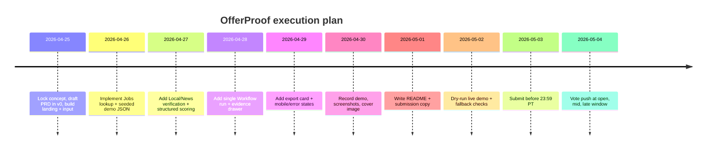

# Contrarian Winning Strategy for Cursor Hackathon

## Executive summary

The first batch likely over-optimized **how to build** and underweighted **why people pick winners**. In Cursor Hackathon, the hard constraints are solo-only, one submission, live-on-entity["company","Vercel","cloud platform"], and a one-day vote window, while winners are chosen by both community votes and the Vercel team. At the same time, the public showcase on April 25 only shows two visible projects: a travel planner and a skincare tool. That means the real edge is not “more AI”; it is a **painkiller agent with obvious utility, visible proof, and a pre-built vote funnel**. citeturn3view0turn1view0turn5view0

My recommendation is to build **OfferProof**: a live agent for students and junior professionals in the entity["country","Philippines","country in southeast asia"] that searches live jobs, verifies company footprint, scans recent news, and returns an evidence-backed shortlist with red/yellow/green trust signals. This fits a real local pain: youth employment softness and underemployment remain meaningful, while phishing and risky URLs surged sharply by end-2025. It also fits Gen Z voting behavior because the result is instantly understandable, screenshot-friendly, and useful today. citeturn21view0turn21view3turn25view0turn25view1turn25view2turn25view3

## Hidden edge and competition audit

### Thesis

The missing angle is **winner selection psychology**: judges want obvious Vercel-native competence, while voters reward instant usefulness and a memorable screenshot. Official docs emphasize durable workflows, tool calling, structured outputs, live deployment, and real integrations; official templates foreground deep research, human approval, and observable runs. The winning edge is probably not more features. The winning edge is **a narrow agent that makes one high-stakes decision visibly better than a human can do alone**. citeturn12search0turn22view0turn8view6turn8view7turn8view4

### Rules edge-case audit

| Confirmed rule | Strategic meaning | Practical move | Risk |
|---|---|---|---|
| Solo, one submission | No split-test at the end | Lock concept by Apr 26 | Mid-build idea switching |
| Live, accessible on Vercel | No auth wall, no broken demos | Ship no-auth demo mode | Login friction kills votes |
| Votes only on May 4 PT | Distribution must be ready before voting opens | Finish assets before submit | “I’ll post later” loses window |
| Community + Vercel input | Build for both taste and usefulness | Explicitly show v0/Vercel use | Pretty app with weak proof |
| PT governs rules | Manila cutoff is not “end of May 3 local” | Treat deadline as May 4 afternoon Manila time | Late submission confusion |
| Cannot vote for own project | Need outside amplifiers | Prep peer/share list early | Invisible launch |

The timing risk is real: during the event window, Manila is UTC+8 while PT is UTC-7, a 15-hour spread. That makes the May 3, 23:59 PT cutoff effectively May 4 afternoon in Manila. citeturn3view0turn26time0turn26time1

### Showcase white-space map

| Category | Sat. | Demo | Judge | Vote | Novelty | Risk | Feas. | Move |
|---|---:|---:|---:|---:|---:|---:|---:|---|
| Travel planners | H | H | M | M | L | M | H | Avoid |
| Consumer skincare/scan | M | M | M | M | M | L | H | Avoid |
| Generic productivity | H | L | L | L | L | L | H | Avoid |
| General research agent | H | M | H | M | L | M | M | Avoid unless niche |
| Jobs + trust | M | H | H | H | H | M | H | **Attack** |
| Scam / trust-safety | M | H | H | H | H | M | H | **Attack** |
| Disaster readiness | L | H | H | H | H | H | M | Attack carefully |
| SME local intel | L | M | H | M | H | M | M | Attack selectively |
| Creator trend research | M | H | M | H | M | L | H | Selective |
| Chat-platform bots | M | M | H | L | M | H | L | Avoid |
| Workflow ops/approval | M | M | H | L | M | M | M | Back-end angle only |

This map is an inference from the current showcase, official Cursor Hackathon tracks, and official agent templates, plus local need indicators around jobs and scams. citeturn1view0turn5view0turn22view0turn22view1turn21view0turn21view3

### Judge delight matrix

| Dimension | Weak | Good | Winning |
|---|---|---|---|
| Technical credibility | Single prompt | Two APIs | Multi-step + typed outputs |
| Agentic depth | Chat only | Tool use | Retrieval + scoring + approval |
| Vercel-native | Hosted app | Next.js deploy | Workflow/AI SDK visibly central |
| v0 leverage | Boilerplate UI | Fast scaffolding | v0 + polish + deploy story |
| Reliability | Hope it works | Basic errors | Demo mode + cache + fallback |
| Novelty | Common niche | Useful niche | Useful + unexpected wedge |
| Usefulness | “Could help” | Saves time | Prevents bad decisions |
| Demo clarity | Abstract | Understandable | One screenshot shows payoff |
| Storytelling | Features list | Problem/solution | Before/after + receipts |
| Polish | Template look | Branded UI | Production-feeling trust UI |
| Social proof | None | Likes | Easy replay/share/result card |

Official Vercel material repeatedly highlights durable execution, structured outputs, human-in-the-loop, research agents, and direct deployment; that is the probable “judge taste profile.” citeturn12search0turn22view0turn22view1turn8view6turn8view7turn16view2

## Vote psychology and the idea field

Filipino audiences are massively reachable on social: DataReportal estimates 90.8 million social media user identities in January 2025 and 95.6 million adult identities by late 2025. Meanwhile, Adobe says nearly half of surveyed consumers used TikTok as a search engine in 2026, and an emerging-market Gen Z study found usage is driven by usefulness, ease, compatibility, and motivation. Translation: the vote winner is the project that looks **useful in five seconds** and feels native to video-first discovery. citeturn25view1turn25view2turn25view0turn25view3

**Vote-magnet checklist:** short name, one-line hook, red/yellow/green output, visible evidence links, “agent is working” timeline, exportable result card, no jargon on first screen, and a CTA framed as “vote if this earned it,” not begging. citeturn25view0turn25view3

### Anti-obvious Manila / SEA ideas

| Rank | Idea | User / pain | Agent + live data | 15s hook | Total |
|---:|---|---|---|---|---:|
| 1 | **OfferProof** | Students, grads; fake/low-signal jobs | Jobs + Local + News + scoring | “It kills sketchy job posts in 40s.” | 64 |
| 2 | ScamSignal | Shoppers, freelancers; scam links/sellers | Search + News + risk card | “Paste a sketchy link; get receipts.” | 62 |
| 3 | BarangayReady | Families; storm prep chaos | Local + News + checklist | “Type your barangay; get the plan.” | 59 |
| 4 | ClientProof | Freelancers; bad clients | Search + News + footprint score | “Vet a client before the call.” | 58 |
| 5 | RentProof | Renters; hidden area tradeoffs | Local + News + ranked areas | “Don’t sign blind.” | 56 |
| 6 | CampusRadar | Students; scattered opportunities | Jobs + News + deadlines | “Find real opportunities, not spam.” | 55 |
| 7 | MarketSnap | MSMEs; local competitor blind spot | Local + Trends + search summary | “See local demand in one run.” | 54 |
| 8 | PricePilot | Gadget buyers; fake deals | Shopping + Search + seller checks | “Cheapest safe buy, not cheapest trap.” | 53 |
| 9 | CreatorAngles | Creators; trend overwhelm | Trends + News + briefs | “Trend → content plan with sources.” | 52 |
| 10 | EventWingman | Builders; missed meetups | Events + Local + route plan | “Never miss the right meetup.” | 50 |
| 11 | VendorScout | Organizers; flaky vendors | Local + reviews + compare | “Shortlist reliable suppliers fast.” | 49 |
| 12 | PermitPal | Founders; process confusion | Search + official pages + steps | “Know where to go, what to bring.” | 47 |
| 13 | LostTime | Citizens; branch/service confusion | Local + hours + required docs | “Find the right branch first.” | 46 |
| 14 | ClinicMatch | Patients; choice overload | Local + reviews + fit ranking | “Pick the right clinic quicker.” | 45 |
| 15 | TruthBoard | Communities; rumor confusion | News + Search + evidence card | “Claim card with receipts.” | 44 |

Scoring weighted uniqueness, usefulness, demo power, vote power, technical credibility, feasibility, and sponsor fit; the top cluster is clearly **trust-safety + career/local decisioning**. SerpApi’s Local, News, Jobs, and Search products directly support that wedge. citeturn8view9turn8view10turn27view0turn8view11

### Painkiller vs vitamin test

| Idea | Painkiller? | Shareable? | Dangerous if wrong? | Score | Keep |
|---|---|---|---|---:|---|
| OfferProof | Yes | Yes | Medium | 9.4 | Keep |
| ScamSignal | Yes | Yes | Medium | 9.1 | Keep |
| BarangayReady | Yes | Yes | High | 8.5 | Keep with guardrails |
| ClientProof | Yes | Medium | Medium | 8.4 | Keep |
| RentProof | Yes | Yes | Medium | 8.2 | Keep |
| CampusRadar | Borderline | Yes | Low | 8.0 | Keep |
| MarketSnap | Mostly vitamin | Low | Low | 7.4 | Kill for votes |

### Agentic proof standard

A winning “real agent” should visibly show at least four of the following: external retrieval, structured scoring, evidence links, multi-step timeline, approval/refinement, saved/exported output, and fallback state. AI SDK supports typed tool calls and typed structured objects; Workflows adds durability and observability; v0 can build full-stack Next.js apps, connect APIs, use MCP, and deploy directly to Vercel. citeturn8view6turn8view7turn8view1turn8view2turn8view3turn8view4turn12search0

| Idea | Retrieval | Score | Evidence | Approval | Export | Verdict |
|---|---|---|---|---|---|---|
| OfferProof | ✓ | ✓ | ✓ | ✓ | ✓ | Best proof |
| ScamSignal | ✓ | ✓ | ✓ | ✓ | ✓ | Strong |
| BarangayReady | ✓ | ✓ | ✓ | ✓ | ✓ | Strong but safety-sensitive |

## Sponsor leverage, tracks, and the chosen concept

### Strongest SerpApi angle

The strongest single endpoint for the chosen wedge is **Google Jobs API** because it returns immediately rankable, structured listings with company, location, schedule signals, descriptions, highlights, and apply options; it also supports cache reuse for identical queries, with cached searches free for one hour. For verification, enrich with Google News and Google Local. This is higher-signal than a generic web search for job discovery. citeturn27view0turn8view10turn8view9

A hidden-but-real angle: SerpApi now has an open-source hosted MCP server and v0 officially supports bring-your-own MCP servers. That is strong sponsor/track alignment, but for an MVP I would treat it as **stretch**, not core, because runtime MCP friction is a bigger risk than direct API integration. citeturn24view0turn24view1turn8view3

### Contrarian track analysis

| Track | Upside | Hidden risk | Verdict |
|---|---|---|---|
| Workflows | Judge-respected reliability, observability, clear Vercel-native story | Overbuilding if you add too many async features | **Pick** |
| v0 + MCPs | Sponsor fit, trendy, simple story if MCP is already working | Runtime MCP/setup ambiguity can eat solo time | Second-best |
| ChatSDK Agents | Strong engineering signal | Platform/webhook friction, weak voter clarity | Reject |

Why Workflows wins: official materials emphasize durable, resumable execution and observability, and official templates already show the exact pattern judges respect—research, structured categorization, and human approval. OfferProof only needs **one** durable workflow, not a giant automation plant. citeturn12search0turn22view0turn5view0

### Final concept

**OfferProof**  
**Hook:** *Before you apply, get proof.*  
**User:** students, fresh grads, and junior professionals searching roles in Manila / SEA.  
**Agent action:** parse job intent, fetch live job results, verify company footprint, scan recent news, score fit + risk, let the user keep/remove jobs, export a shortlist.  
**Why it wins:** It attacks a real local pain, produces a clear red/yellow/green screenshot, uses real-time data, and turns “AI agent” from vague magic into a visible evidence pipeline. The emotional payoff is high: *it saves you from wasting time or getting burned*. citeturn21view0turn21view3turn27view0turn8view9turn8view10

### Demo theatre

| Idea | 10s hook | 30s beat | 5m flow | Backup |
|---|---|---|---|---|
| OfferProof | “Everyone knows a bad job post. This catches them before you apply.” | Enter “junior frontend Manila”; step chips fire; 2 red, 3 green cards appear | query → workflow → evidence drawer → remove one job → export shortlist | Seeded query + demo mode |
| ScamSignal | “Paste any sketchy link. Get a verdict with receipts.” | Paste a URL; search + news + company signals; risk card | input → scan → risk evidence → share card | Preloaded suspicious sample |
| BarangayReady | “Type your barangay; get a storm-day action pack.” | Enter location; nearest essentials + official updates + checklist | location → verify sources → kit → export | Static locality demo |

## MVP, reliability, and launch

### Ugly but wins roadmap

| Stage | Must-have |
|---|---|
| 2h | Landing, query form, seeded result cards, one live Jobs lookup |
| 6h | Jobs + Local + News enrichers, structured score, colored verdict cards |
| 12h | Single Workflow run, evidence drawer, keep/remove approval, export card |
| 1.0 | Mobile polish, demo mode, screenshots, README, submission copy |
| 1.1 | Motion polish only |

**Kill list:** auth, accounts, resumes/OCR, maps, Slack, multi-user history, fancy analytics, custom DB unless absolutely needed. v0 can handle full-stack Next.js, external APIs, GitHub branching, and one-click publish, so use it aggressively for shell/UI and keep custom code for agent logic only. citeturn8view1turn8view2turn16view1turn8view4

### Reliability and fallback plan

| Failure | Fallback |
|---|---|
| SerpApi quota / rate limit | Cache last-success results; identical Jobs queries can reuse free cached responses |
| Slow API | Show step skeletons + “search in progress”; reveal partial cards |
| No results | Suggest nearby city / remote toggle / broader role chip |
| Model confusion | Never let model invent listings; only score retrieved evidence |
| Deployment break | `/demo` route with frozen JSON + prerecorded GIF |
| Submission-day panic | Freeze features 24h before submit |

### Submission conversion audit

**Title:** OfferProof — AI agent that finds legit jobs and flags sketchy ones  
**First line:** Paste a role or job post; OfferProof searches live listings, checks company footprint and recent news, then gives you an evidence-backed shortlist.  
**Hero screenshot:** left = query + workflow timeline, right = three green/yellow/red job cards with evidence count.  
**GIF:** query → steps running → two risky jobs disappear → shortlist export.  
**Technical proof paragraph:** Built with Next.js, v0-generated UI, Vercel AI SDK structured outputs, one Vercel Workflow for deterministic multi-step verification, and SerpApi Jobs/News/Local for real-time evidence.  
**Vote CTA:** *If this would have saved you one bad apply, vote for OfferProof.* citeturn5view0turn8view4turn12search0turn8view6turn8view7turn27view0

### Social distribution and vote campaign

| Channel | Timing | Copy |
|---|---|---|
| TikTok/Reel | submit day | “Job hunting is messy. I built an agent that finds real jobs and flags sketchy ones with receipts.” |
| X | submit day | “Built OfferProof for Cursor Hackathon: live job search + company/news verification + red-flag score.” |
| LinkedIn | submit day | “Solo-built a Vercel agent that helps candidates avoid bad applies and focus on evidence-backed roles.” |
| Discord/class GC | voting day | “I built something real for job hunting—vote only if the demo earns it.” |
| Vercel comment | voting day | “Happy to answer about Workflow + AI SDK + SerpApi design choices.” |

The tone should feel earned, not needy; that matters in a one-day vote window. citeturn3view0turn25view0turn25view3

The execution window is driven by the official rules and the Manila/PT spread. citeturn3view0turn26time0turn26time1



## Red-team and final recommendation

### Top five critiques

| Idea | Why it may lose | Defense |
|---|---|---|
| OfferProof | Could look like a job board clone | Make evidence, risk score, and trust cards the hero |
| ScamSignal | Too broad, harder to prove | Narrow to jobs/listings first |
| BarangayReady | Safety-critical accuracy risk | Keep it to preparedness + official links, not evacuation authority |
| ClientProof | Narrower audience | Good backup, weaker public vote |
| RentProof | Nice, but slower payoff | Better as sequel, not main entry |

### Final recommendation

**Build:** **OfferProof**  
**Track:** **Workflows**  
**Stack:** Next.js App Router, TypeScript, Tailwind, shadcn/ui, v0, Vercel AI SDK + AI Gateway, one Vercel Workflow, SerpApi Google Jobs + Google News + Google Local, localStorage history, no auth.  
**MVP scope:** one query, one visible workflow, one structured shortlist, one evidence drawer, one keep/remove approval, one export card, one demo mode.  
**5-minute demo:** query → agent steps → live Jobs pull → company/news verification → green/yellow/red shortlist → remove one risky job → export “3 jobs worth applying to today.”  
**15s script:** “Paste a job query. OfferProof finds live openings, checks the company, flags sketchy ones, and gives you a real shortlist.”  

**First v0 prompt**
```text
Build “OfferProof,” a production-ready Next.js app for Cursor Hackathon.
Purpose: user enters a job role/location or pastes a job post; the app runs a 4-step agent workflow:
1) fetch live job listings,
2) verify company footprint,
3) scan recent news,
4) produce a structured fit-and-risk shortlist.
Requirements:
- Tailwind + shadcn/ui
- one-screen hero demo
- visible step timeline
- red/yellow/green result cards
- evidence drawer with source links
- keep/remove approval interaction
- export shortlist as image/card
- no auth
- demo mode with seeded JSON fallback
- ready for Vercel deployment
First output only: PRD, route map, component tree, server actions/API plan, workflow step plan, data schema, fallback plan, and build order. Do not generate code yet.
```

**Next 10 actions**
1. Lock OfferProof.  
2. Run the v0 PRD prompt.  
3. Generate landing + input shell.  
4. Wire Google Jobs route first.  
5. Add structured score schema.  
6. Add News + Local verification.  
7. Wrap the sequence in one Workflow.  
8. Build evidence drawer + export.  
9. Create `/demo` seeded route.  
10. Record 15s, 60s, and 5m demos before final polish.  

**Forgotten edge summary:**  
Biggest miss: optimizing build steps instead of selection psychology.  
Biggest opportunity: trust-safety + careers is still wide open.  
Biggest hidden risk: a strong build with weak launch assets still loses on May 4.  
Fastest way to look like a winner: show one painful problem, one live workflow, and one screenshot-worthy verdict.  
Fastest way to lose: build a generic assistant and explain it with jargon.  
**Mantra:** *Don’t build more AI; build one decision people are scared to get wrong.*