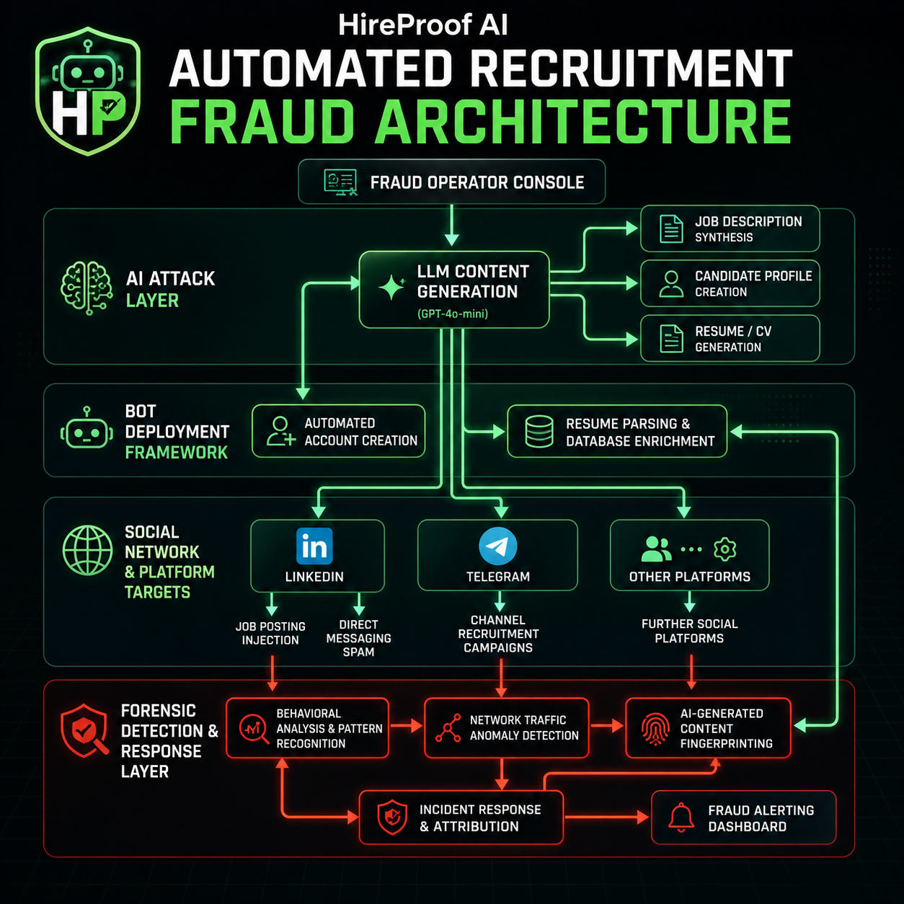

# HireProof Developer Case Study

## Project

HireProof is a production-facing AI agent application for checking suspicious job posts, recruiter messages, screenshots, and apply links.

Built solo by Mark Siazon in about one week for the Cursor Hackathon.

## Stack

| Layer | Implementation |
| --- | --- |
| App | Next.js App Router, React, TypeScript, Tailwind CSS |
| AI | Vercel AI SDK, AI Gateway, OpenAI-compatible fallback |
| Evidence | SerpApi, OCR, URL/apply-path checks, provider fallbacks |
| Storage | Upstash Redis when configured, local development fallback |
| Agent surfaces | Web, API, MCP, ChatSDK routes, WDK route |
| Distribution | CLI, SDK, LangChain package, n8n node, Make source pack, Chrome extension package |
| Ops | Health route, release proof docs, cost-safety guardrails |

## Architecture

Runtime shape:

1. The web app submits an audit through the audit API.
2. The system extracts structured claims from the post, message, screenshot, or URL.
3. Evidence tools check company presence, news, jobs, local footprint, OCR text, and apply-path consistency.
4. The risk policy creates a Safe, Caution, or High-Risk report with visible reasons.
5. Reports can be opened in the UI, exported, shared, or consumed by external agents.

## Agent And Integration Breadth

HireProof was built as one verification core with multiple ways to use it:

- Web app for job seekers.
- Headless JSON API for integrations.
- MCP endpoint for agent-compatible tools.
- ChatSDK routes for Slack, Discord, Telegram, and related chat surfaces.
- Vercel Workflow / WDK route for background investigations.
- CLI for terminal audits and a TUI-style interface.
- JavaScript/TypeScript SDK.
- LangChain tool package.
- n8n package and Make source pack.
- Chrome extension package for browser-side scanning.

## Three-Track Coverage

| Track | Coverage |
| --- | --- |
| v0 + MCPs | Next.js app, visible audit flow, runtime MCP investigation tools. |
| ChatSDK Agents | Shared bot reply path and chat platform routes, with Slack/Telegram proof boundaries documented. |
| Vercel Workflow / WDK | Workflow route and production accepted-run proof, with completed-result proof kept as a future boundary. |

## Engineering Decisions

### Transparent Risk Policy

The shipped product uses an evidence-weighted safety policy rather than claiming continuous ML. This keeps the product explainable and judge-safe.

### Provider Boundaries

Live evidence depends on configured model, search, OCR, and optional provider credentials. Demo mode exists for deterministic review and is labeled as seeded fixture evidence.

### Cost Guardrails

After-hackathon use can trigger real provider costs. The local after-hackathon plan adds flags and provider guards for model, SerpApi, Google Vision OCR, and Safe Browsing usage, with BYOK as the serious-usage path.

### Package-Oriented Distribution

The project is designed for more than a web demo. CLI, SDK, LangChain, n8n, Make, and extension surfaces make the core verification flow reusable.

## Verification Mindset

The project keeps proof and boundaries visible:

- Local lint/build/runtime tests are the minimum verification gate.
- Production app and API health are checked by direct URL/API calls.
- Docs separate live proof from credential-ready or roadmap surfaces.
- Release assets and screenshots support portfolio review, pilot conversations, and future maintainer handoff.
- Public claims avoid unsupported ML, generic fraud, or completed workflow statements.

## CLI Visual

## What This Demonstrates

- Full-stack product implementation under a strict deadline.
- AI agent workflow design with evidence tools.
- API and integration architecture.
- Product-safe claims and proof documentation.
- Launch assets, packages, release notes, and post-hackathon cost planning.
- Ability to balance product design, UI/UX, engineering, and shipping discipline as a solo builder.

## Portfolio Summary

HireProof shows how I build production-facing AI products: start with a painful user decision, design an evidence-first flow, expose the core through practical developer surfaces, verify what is real, and document the boundaries honestly.

